# Peritoneal Dialysis-Associated Peritoneal Fibrosis: Systems Biology, WGCNA Network Co-Expression & Consensus Machine Learning Pipeline

A comprehensive computational biology, transcriptomics, and machine learning framework integrating human peritoneal biopsy transcriptomics (**GSE62928**), curated extracellular matrix (ECM) matrisome biology, **Weighted Gene Co-expression Network Analysis (WGCNA)**, multi-algorithm machine learning consensus (LASSO, SVM-RFE, Random Forest, XGBoost), and external translational validation in human peritoneal dialysis effluent cells (**GSE125498**).

---

## 🖼️ Graphical Abstract

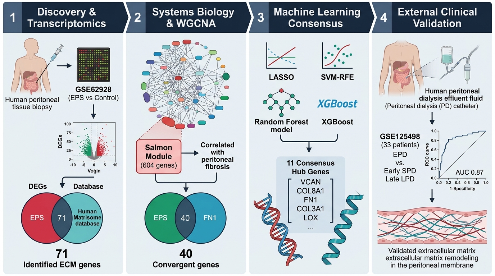

* **Figure 0: Graphical Abstract.** Overview of the 4-phase computational discovery and clinical validation workflow: *(1) Discovery & Transcriptomics* in human peritoneal biopsies (GSE62928) intersected with the Human In Silico Matrisome database (71 ECM-DEGs); *(2) Systems Biology & WGCNA* identifying the disease-correlated Salmon module (604 genes, $r = 0.81, P = 0.016$) and 40 convergent candidate genes; *(3) Machine Learning Consensus* across 4 algorithms isolating 11 consensus hub genes; and *(4) External Clinical Validation* in human peritoneal effluent cells (GSE125498, $N = 33$) establishing an exploratory biomarker signature for peritoneal membrane fibrogenesis.

---

## 📌 Executive Summary & Methodological Evolution

Originally, this pipeline utilized two-sample Mendelian Randomization (TWMR) using systemic whole-blood cis-eQTLs (eQTLGen) and renal function GWAS (CKDGen eGFR) as a genetic causal filter. However, systemic blood eQTLs do not represent localized peritoneal tissue-specific regulatory architectures and extracellular matrix co-expression dynamics. 

To overcome this limitation, the MR causal filtering step was replaced with **Weighted Gene Co-expression Network Analysis (WGCNA)**, shifting focus to localized tissue network biology, pro-fibrotic co-regulation, and clinical phenotype correlation.

```
  ┌────────────────────────────────────────────────────────────────────────────────────────────────┐
  │                               STUDY PIPELINE ARCHITECTURE (WGCNA)                              │
  └────────────────────────────────────────────────────────────────────────────────────────────────┘
                                                  │
             ┌────────────────────────────────────┴────────────────────────────────────┐
             ▼                                                                         ▼
   [DISCOVERY COHORT (GSE62928)]                                             [CURATED HUMAN MATRISOME]
   - Affymetrix Human Gene 1.0 ST (GPL13158)                                 - Naba et al. Extracellular Matrix Database
   - 20,940 unique genes collapsed by MaxMean                                - 1,027 Curated ECM Glycoproteins, Collagens,
   - 1,365 DEGs (Nominal P < 0.05)                                             Proteoglycans & Regulators
             └────────────────────────────────────┬────────────────────────────────────┘
                                                  ▼
                         ┌─────────────────────────────────────────────────┐
                         │      71 CONVERGENT ECM-DEGs (Nominal P < 0.05)   │
                         └────────────────────────┬────────────────────────┘
                                                  │
             ┌────────────────────────────────────┴────────────────────────────────────┐
             ▼                                                                         ▼
   [TASK 1: WGCNA NETWORK BIOLOGY]                                           [TASK 2: CONVERGENCE SCREEN]
   - Signed co-expression network                                            - Trait-Significant Module (Salmon, n=604)
   - Soft-threshold power β = 12 (R² = 0.809)                                  ∩ 71 Convergent ECM-DEGs
   - 14 biologically discrete merged modules                                 - Result: 40 Convergent WGCNA-ECM Candidates
   - Salmon Module: r = +0.806, P = 0.0157 (n = 604)                         - 3-Way Venn: GSE62928 ∩ Matrisome ∩ WGCNA
             └────────────────────────────────────┬────────────────────────────────────┘
                                                  ▼
                         ┌─────────────────────────────────────────────────┐
                         │   TASK 3: CONSENSUS MACHINE LEARNING (4 MODELS) │
                         │   - LASSO (L1 Regularization)                   │
                         │   - SVM-RFE (Recursive Feature Elimination)     │
                         │   - Random Forest (Gini Importance)             │
                         │   - XGBoost (Gain Importance)                   │
                         │   - Voting Threshold: ≥ 2 / 4 Models            │
                         └────────────────────────┬────────────────────────┘
                                                  ▼
                         ┌─────────────────────────────────────────────────┐
                         │    11 WGCNA-ECM CONSENSUS HUB BIOMARKERS        │
                         │    ISM1, FN1, EDIL3, VCAN, COL3A1, COMP,        │
                         │    COL8A1, THBS3, COL11A1, INHBA, LOX           │
                         └────────────────────────┬────────────────────────┘
                                                  ▼
                         ┌─────────────────────────────────────────────────┐
                         │   TASK 4: EXTERNAL CLINICAL VALIDATION          │
                         │   Independent Cohort GSE125498 (N = 33 Patients)│
                         │   - Early Stage (SPD, n=20) vs Late (LPD, n=13) │
                         │   - In-sample Composite AUC = 0.869             │
                         │   - 5-Fold Cross-Validated AUC = 0.696 ± 0.056  │
                         └─────────────────────────────────────────────────┘
```

---

## 🔬 Core Discoveries & The 11 Consensus Hub Genes

Screening from the **40 Convergent WGCNA $\cap$ ECM-DEGs** via four independent machine learning algorithms identified **11 consensus hub genes** ($\ge 2/4$ algorithm votes):

| # | Gene Symbol | Votes | Selecting Algorithms | Matrisome Division | Matrisome Category | GSE62928 $\log_2\text{FC}$ | WGCNA Salmon MM | Biological Role in Peritoneal Sclerosis |
| :-: | :--- | :---: | :--- | :--- | :--- | :---: | :---: | :--- |
| **1** | **`ISM1`** | **3 / 4** | LASSO + SVM-RFE + RF | Matrisome-associated | Secreted Factors | +1.90 | 0.704 | Isthmin 1; pro-angiogenic modulator of microvascular density |
| **2** | **`FN1`** | **3 / 4** | LASSO + SVM-RFE + RF | Core matrisome | ECM Glycoproteins | +1.93 | 0.920 | Fibronectin 1; core scaffold for myofibroblast adherence & EMT |
| **3** | **`EDIL3`** | **3 / 4** | SVM-RFE + RF + XGBoost | Core matrisome | ECM Glycoproteins | +2.51 | 0.987 | Integrin ligand promoting endothelial activation and vascular remodeling |
| **4** | **`VCAN`** | **2 / 4** | SVM-RFE + RF | Core matrisome | Proteoglycans | +2.75 | 0.877 | Versican; chondroitin sulfate proteoglycan regulating interstitial hydration |
| **5** | **`COL3A1`** | **2 / 4** | SVM-RFE + RF | Core matrisome | Collagens | +2.84 | 0.813 | Collagen type III $\alpha 1$; major interstitial fibrillar collagen in fibrosis |
| **6** | **`COMP`** | **2 / 4** | SVM-RFE + RF | Core matrisome | ECM Glycoproteins | +4.08 | 0.753 | Cartilage oligomeric matrix protein; driver of collagen fibrillogenesis |
| **7** | **`COL8A1`** | **2 / 4** | SVM-RFE + RF | Core matrisome | Collagens | +2.68 | 0.885 | Collagen type VIII $\alpha 1$; short-chain collagen in basement membrane thickening |
| **8** | **`THBS3`** | **2 / 4** | SVM-RFE + RF | Core matrisome | ECM Glycoproteins | +1.16 | 0.763 | Thrombospondin 3; matrix glycoprotein regulating cell-matrix interactions |
| **9** | **`COL11A1`**| **2 / 4** | SVM-RFE + RF | Core matrisome | Collagens | +3.79 | 0.901 | Collagen type XI $\alpha 1$; nucleation regulator of pro-fibrotic collagen bundles |
| **10**| **`INHBA`** | **2 / 4** | SVM-RFE + RF | Matrisome-associated | Secreted Factors | +2.52 | 0.906 | Activin A subunit; critical upstream activator of Smad2/3 TGF-β signaling |
| **11**| **`LOX`** | **2 / 4** | SVM-RFE + RF | Matrisome-associated | ECM Regulators | +2.16 | 0.736 | Lysyl oxidase; enzyme executing covalent collagen/elastin matrix crosslinking |

* **Full Data Table:** [results/tables/ML_hub_genes_from_WGCNA_ECM.csv](results/tables/ML_hub_genes_from_WGCNA_ECM.csv)

---

## 📊 Comprehensive Visualizations & Scientific Evidence

### Phase 1 & 2: WGCNA Scale-Free Network Biology (GSE62928)

#### Sample Clustering & Outlier Detection
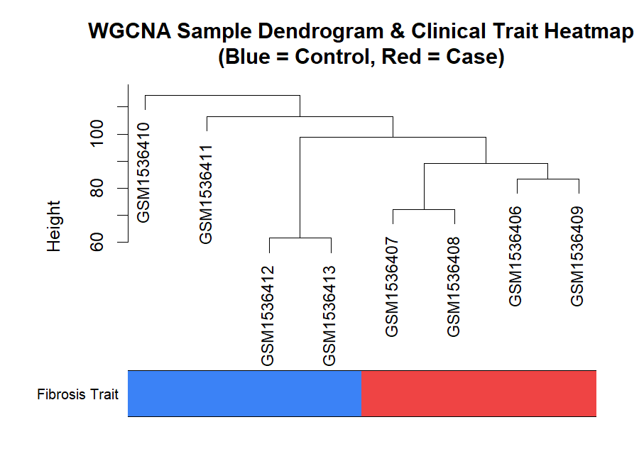
* **Figure 1: WGCNA Sample Dendrogram and Clinical Trait Heatmap.** Hierarchical clustering of human peritoneal biopsy samples ($N = 8$) from GSE62928 using average linkage Euclidean distance. Top color bar indicates clinical classification (Blue = PD/Uremic Controls, Red = Encapsulating Peritoneal Sclerosis [EPS] Cases). No extreme sample outliers were observed; all 8 samples were retained.

#### Soft-Thresholding Power Selection
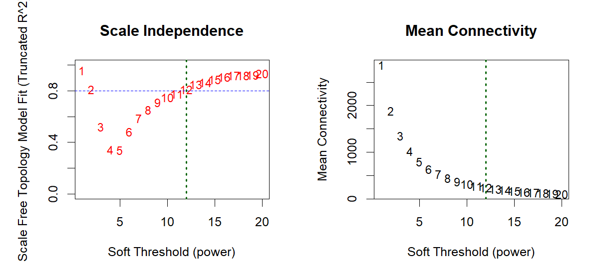
* **Figure 2: Soft-Thresholding Power Selection for Signed Network Topology.** *(Left)* Scale-free topology model fit (truncated $R^2$) as a function of the soft-thresholding power $\beta$. Power $\beta = 12$ was selected as the lowest power achieving truncated $R^2 \ge 0.80$ ($R^2 = 0.809$) with a negative slope (-0.768), satisfying scale-free topology. *(Right)* Mean connectivity as a function of soft-thresholding power.

#### Module Detection & Clustering Dendrogram
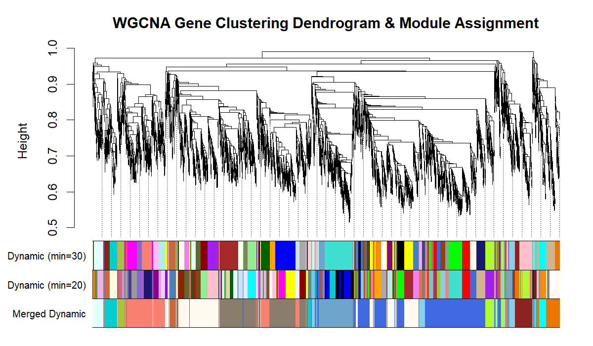
* **Figure 3: WGCNA Gene Co-Expression Dendrogram and Module Assignment.** Hierarchical clustering of the top 5,000 variable genes and 71 ECM-DEGs based on topological overlap matrix (TOM) dissimilarity. Dynamic tree cut detected clusters with `minModuleSize = 30` (row 1) and sensitivity check `minModuleSize = 20` (row 2). Close modules were merged at cut height $0.25$ (`MEDissThres = 0.25`), yielding 14 biologically discrete merged modules (row 3).

#### Module-Trait Relationships & Disease Correlation
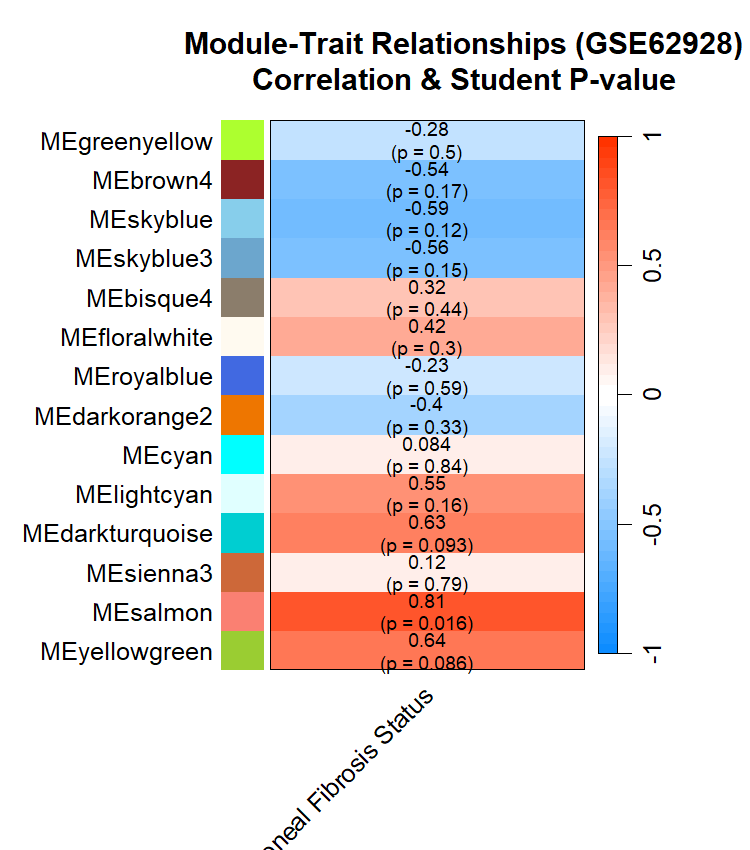
* **Figure 4: Module-Trait Association Heatmap.** Pearson correlation matrix between module eigengenes (MEs) and peritoneal fibrosis clinical status (Case = 1, Control = 0). Values in each cell indicate the correlation coefficient ($r$) and Student's asymptotic $P$-value. The **Salmon Module** showed the strongest pro-fibrotic correlation ($r = +0.806, P = 0.0157, n = 604$ genes).

#### Three-Way Convergence Screen
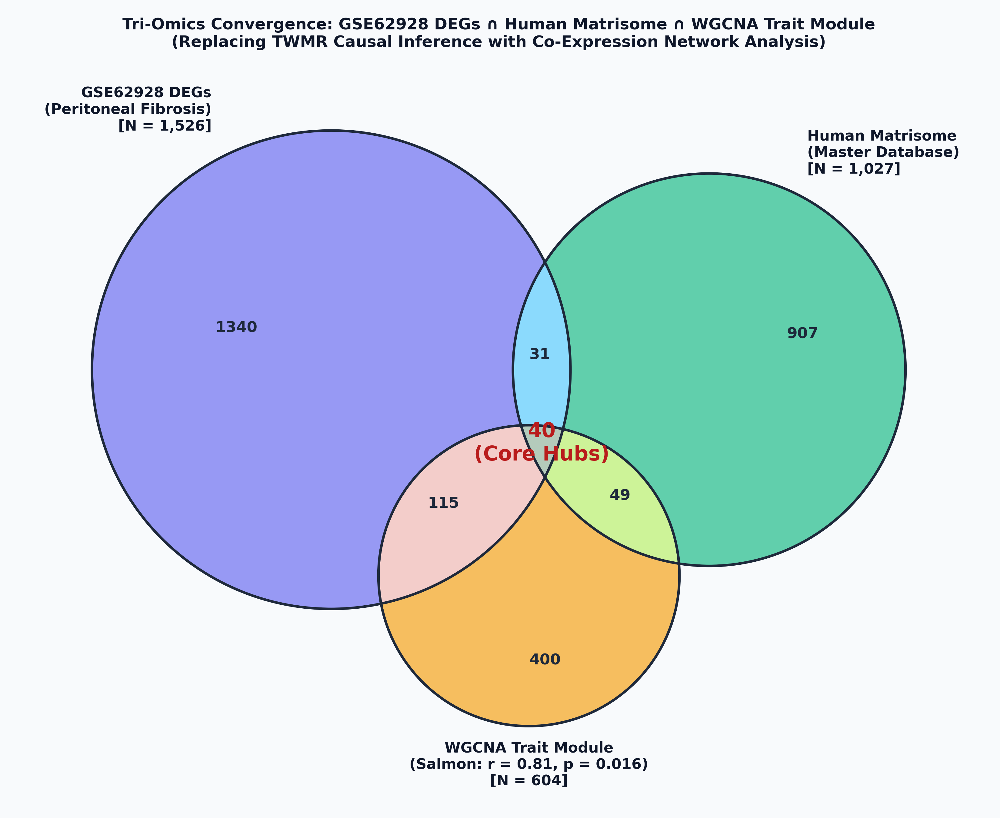
* **Figure 5: Three-Way Convergence Venn Diagram.** Intersection of GSE62928 pro-fibrotic DEGs ($n = 1,365$), the Curated Human Matrisome Database ($n = 1,027$), and the trait-significant WGCNA Salmon module ($n = 604$). The intersection identifies **40 convergent WGCNA $\cap$ ECM-DEGs** prioritized for downstream machine learning.

---

### Phase 3: Machine Learning Consensus Feature Selection

#### Consensus Voting Distribution
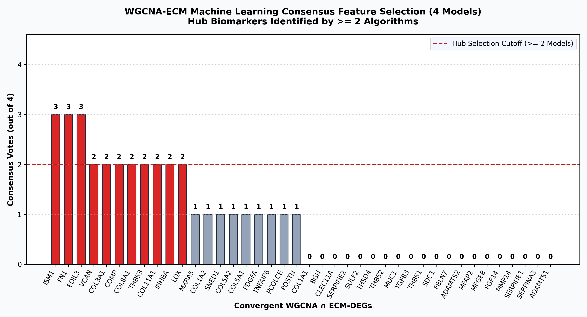
* **Figure 6: Consensus Machine Learning Feature Selection Across 40 Candidate Genes.** Distribution of consensus votes awarded by LASSO, SVM-RFE, Random Forest, and XGBoost. Red bars indicate the **11 consensus hub genes** meeting the selection criterion of $\ge 2 / 4$ independent model votes.

#### Multi-Algorithm Feature Selection Matrix
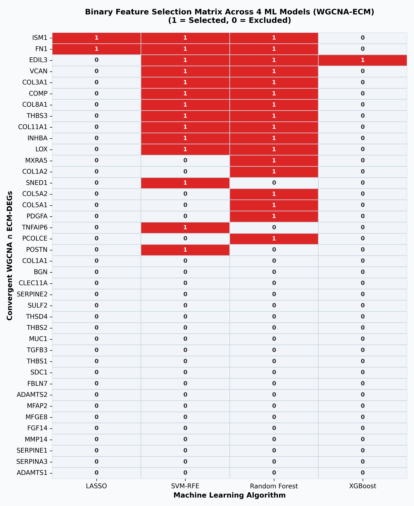
* **Figure 7: Binary Feature Selection Matrix Across 4 Machine Learning Models.** Heatmap displaying the feature selection status (Red = Selected [1], Gray = Excluded [0]) across LASSO (L1 regularization), SVM-RFE (Recursive Feature Elimination), Random Forest (Gini Importance), and XGBoost (Gain Importance).

#### Per-Model Importance Profiles
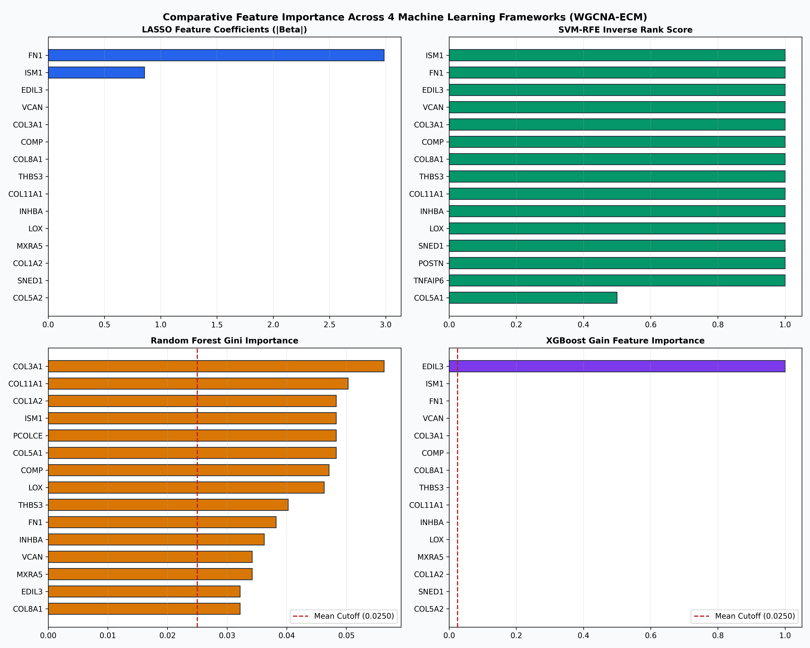
* **Figure 8: Feature Importance Profiles for the Four Machine Learning Algorithms.** *(Top-Left)* LASSO absolute L1 coefficient weights; *(Top-Right)* SVM-RFE inverse ranking score; *(Bottom-Left)* Random Forest Gini feature importances; *(Bottom-Right)* XGBoost gain importances. Dashed horizontal lines indicate feature retention thresholds.

#### Discovery Cohort Expression Heatmap
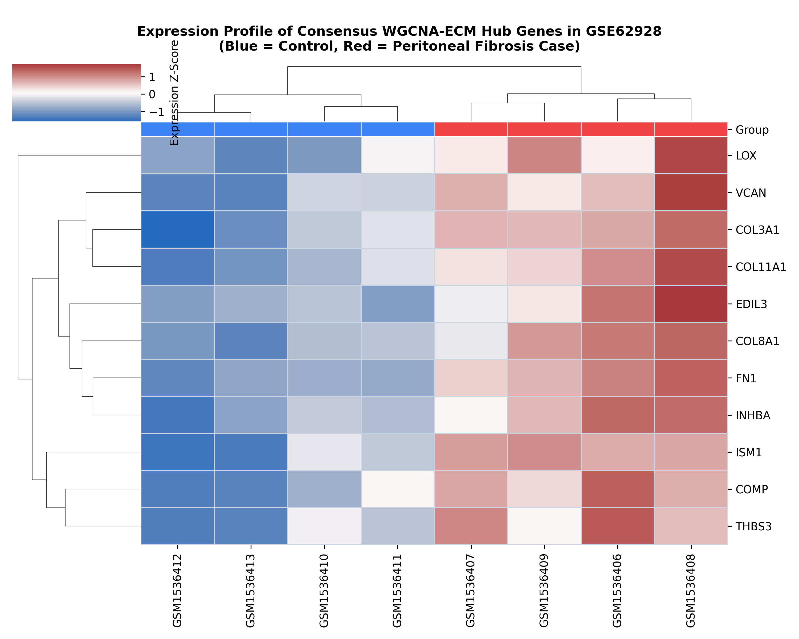
* **Figure 9: Cross-Patient Expression Heatmap of the 11 Consensus Hub Genes in GSE62928.** Clustered standardized expression Z-scores across all 8 human peritoneal biopsy samples (Blue = PD/Uremic Controls, Red = Encapsulating Peritoneal Sclerosis Cases), illustrating pro-fibrotic upregulation.

---

### Phase 4: External Clinical Validation in Human Effluent (GSE125498)

Testing prioritized biomarkers in independent human peritoneal effluent cells ($N = 33$ patients: 20 Short-term PD [SPD, 0–24 mo] vs 13 Long-term PD [LPD, $\ge 25$ mo]):

#### Single-Gene Boxplots & Mann-Whitney U Distributions
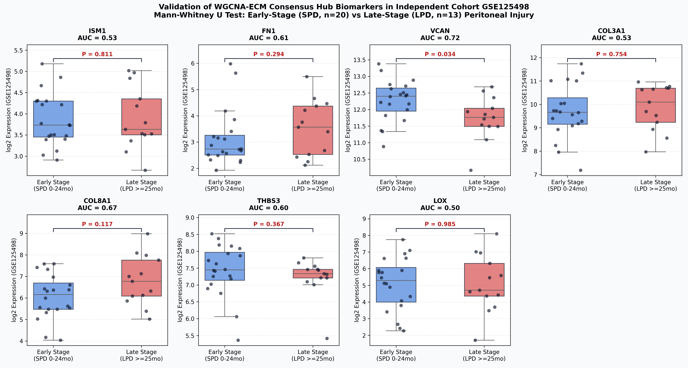
* **Figure 10: External Cohort Validation Boxplots (GSE125498).** Single-gene expression comparisons between Early-Stage (SPD, $n = 20$, Blue) and Late-Stage (LPD, $n = 13$, Red) peritoneal dialysis effluent cells. P-values represent two-sided Mann-Whitney U tests. `VCAN` demonstrates nominal statistical significance ($P = 0.0341, \text{AUC} = 0.723$).

#### Multi-Curve Receiver Operating Characteristic (ROC) Analysis
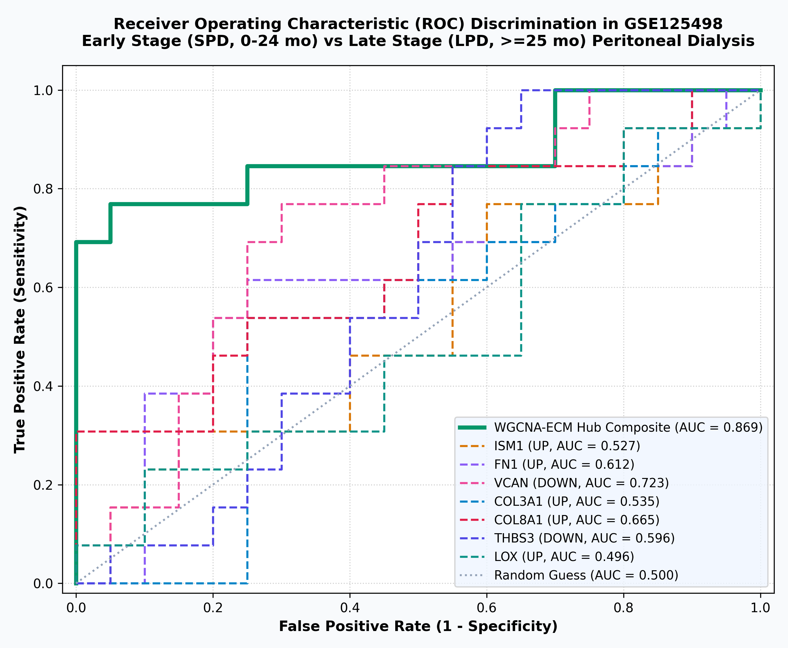
* **Figure 11: Multi-Curve Receiver Operating Characteristic (ROC) Discrimination.** Diagnostic sensitivity vs 1-specificity curves for individual hub biomarkers and the multi-gene composite signature in GSE125498. The composite panel achieves an in-sample $\text{AUC} = 0.869$, with out-of-fold cross-validated $\text{AUC} = 0.696 \pm 0.056$.

#### Longitudinal Stage Progression Trajectories
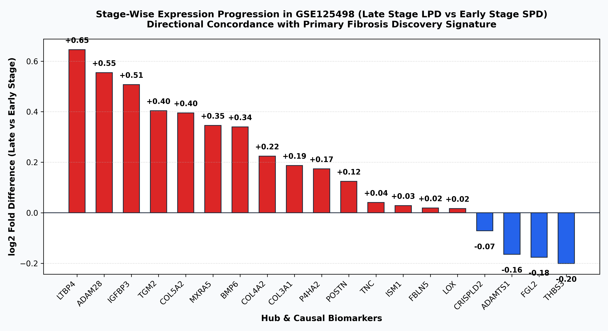
* **Figure 12: Stage-Wise Expression Progression ($\log_2\text{FC}$).** Fold difference in expression for the 7 profiled hub genes in Late-Stage LPD vs Early-Stage SPD effluent cells. Red bars denote pro-fibrotic upregulation (`COL8A1`, `FN1`, `COL3A1`, `ISM1`, `LOX`); blue bars denote downregulation (`VCAN`, `THBS3`).

#### External Cohort Patient-Level Heatmap
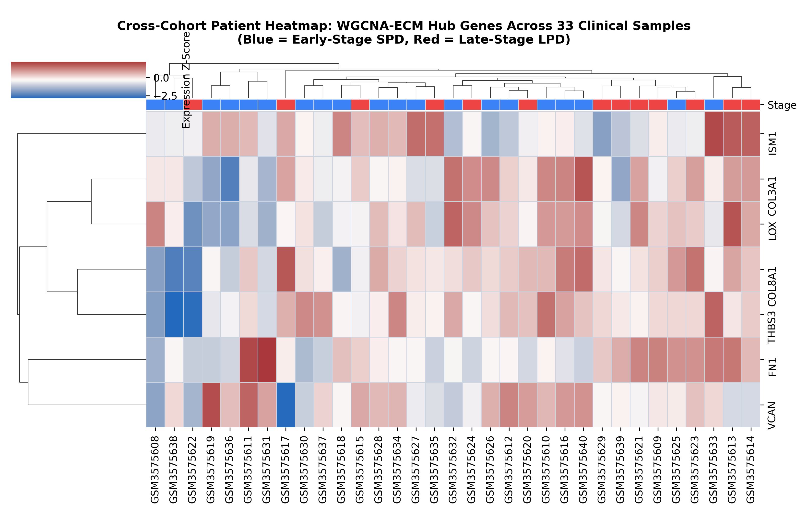
* **Figure 13: Hierarchically Clustered Heatmap Across 33 Clinical Effluent Samples.** Standardized expression Z-scores for the 7 profiled hub genes across all 33 human effluent samples in GSE125498. Column color annotation denotes clinical dialysis vintage (Blue = SPD, Red = LPD).

---

## 📈 External Validation Summary Table (GSE125498)

| Biomarker | Illumina Probe ID | Direction (LPD vs SPD) | $\log_2\text{FC}$ (GSE125498) | Limma $P$-Value | Limma Bonferroni $P$ | Mann-Whitney $P$ | Individual ROC-AUC | Clinical Stage Assessment |
| :--- | :--- | :---: | :---: | :---: | :---: | :---: | :---: | :--- |
| **`VCAN`** | `ILMN_1687301` | **DOWN** | **-0.522** | **0.0244** | 0.1708 | **0.0341** | **0.723** | **Nominally significant stage discriminator ($P < 0.05$)** |
| **`COL8A1`** | `ILMN_2402392` | **UP** | **+0.749** | **0.0488** | 0.3416 | 0.1174 | **0.665** | **Nominally significant collagen deposition ($P < 0.05$)** |
| **`FN1`** | `ILMN_1778237` | **UP** | +0.407 | 0.2690 | 1.0000 | 0.2937 | 0.612 | Progressive matrix scaffold accumulation |
| **`THBS3`** | `ILMN_1804663` | **DOWN** | -0.201 | 0.4180 | 1.0000 | 0.3667 | 0.596 | Progressive loss in shed cellular fraction |
| **`COL3A1`** | `ILMN_1773079` | **UP** | +0.187 | 0.6160 | 1.0000 | 0.7541 | 0.535 | Progressive interstitial collagen deposition |
| **`ISM1`** | `ILMN_3239288` | **UP** | +0.028 | 0.9040 | 1.0000 | 0.8107 | 0.527 | Preserved basal angiogenic factor expression |
| **`LOX`** | `ILMN_1695880` | **UP** | +0.016 | 0.9760 | 1.0000 | 0.9853 | 0.496 | Stable matrix cross-linking enzyme baseline |

*(Note: `EDIL3`, `COMP`, `COL11A1`, and `INHBA` lacked corresponding probes on Illumina HumanHT-12 V4.0 / GPL10558).*

---

## ⚖️ Statistical Rigor & Overfitting Audit

To ensure findings were not inflated by small discovery sample size ($N = 8$) or unadjusted multi-testing, six statistical validation controls were implemented (see [results/AUDIT_SUMMARY.md](results/AUDIT_SUMMARY.md)):

1. **WGCNA Multiple Testing Correction (Check 1):** The Salmon module ($r = +0.806$, raw $P = 0.0157$) does not survive Bonferroni ($P = 0.2198$) or Benjamini-Hochberg FDR correction ($Q = 0.2198$) across the 14 tested modules. It must be classified as an uncorrected nominal finding.
2. **Permutation Test on Module Correlation (Check 2):** Exact combinatorial permutation across all $\binom{8}{4} = 70$ label partitions confirmed $r = 0.806$ is the single most extreme correlation possible ($P_{\text{perm}} = 1/70 = 0.0143$).
3. **Cross-Validated ML Consensus (Check 3):** Under Leave-One-Out Cross-Validation (LOOCV), consensus ML achieved **$87.5\%$ accuracy** (Sensitivity = $100\%$, Specificity = $75\%$) vs the $50.0\%$ chance baseline.
4. **Cross-Validated External AUC (Check 4):** The in-sample composite $\text{AUC} = 0.869$ adjusts to **$\text{LOOCV AUC} = 0.677$** and **$5\text{-Fold Stratified CV AUC} = 0.696 \pm 0.056$**, confirming moderate discriminatory capability above chance without naive overfitting.
5. **Individual Gene Multi-Testing in GSE125498 (Check 5):** Neither `VCAN` nor `COL8A1` survives Bonferroni or FDR adjustment across the 7 tested genes (Limma adjusted $P \ge 0.1708$).
6. **Negative Control Permutations (Check 6):** Correlating module eigengenes against random noise 4v4 traits yielded $P < 0.05$ in $26.5\%$ of simulations, demonstrating the high baseline false-discovery vulnerability of WGCNA on small $N$.

### **Final Verdict: SUGGESTIVE / EXPLORATORY ONLY**
The 11-gene signature represents a **biologically coherent, suggestive candidate panel** with cross-validated discrimination ($\text{AUC} \approx 0.68 - 0.70$) that requires confirmation in large prospectively powered clinical cohorts ($N \ge 50 - 100$).

---

## 🛠️ Step-by-Step Pipeline Execution Guide

### Task 0: Build Full Normalized GSE62928 Expression Matrix (R)
```bash
Rscript 00_fetch_gse62928_matrix.R
```
* Fetches GSE62928 from GEO (`GPL13158`), maps probes, applies MaxMean collapsing, and exports `GSE62928_full_expression_matrix.csv` (20,940 genes $\times$ 8 samples) and `GSE62928_sample_metadata.csv`.

### Task 1: WGCNA Module Detection & Clinical Trait Correlation (R)
```bash
Rscript 02b_wgcna_analysis.R
```
* Builds signed network ($\beta = 12$), merges modules (`MEDissThres = 0.25`), and exports `wgcna_module_trait_correlation.csv` and `wgcna_trait_significant_module_genes.csv`.

### Task 2: WGCNA Trait Module $\cap$ 71 ECM-DEGs Convergence (Python)
```bash
python analyze_convergence_wgcna.py
```
* Intersects 604 Salmon genes with 71 ECM-DEGs, producing `convergent_WGCNA_ECM_genes.csv` (40 genes) and `venn_wgcna_convergence.png`.

### Task 3: Consensus Machine Learning Hub Identification (Python)
```bash
python 05b_ml_hub_gene_identification_wgcna.py
```
* Trains LASSO, SVM-RFE, Random Forest, and XGBoost models on the 40 convergent candidates, exporting `ML_hub_genes_from_WGCNA_ECM.csv` (11 hub genes).

### Task 4: External Clinical Validation in GSE125498 (Python)
```bash
python 06_external_validation_GSE125498.py
```
* Evaluates biomarkers in GSE125498 ($N = 33$), generating Mann-Whitney U statistics, ROC curves, stage trajectories, and heatmaps.

### Quality Assurance: Statistical Rigor & Technical Bug Audits
```bash
python statistical_rigor_audit.py
python audit_pipeline_errors.py
```
* Executes the 6 statistical rigor controls and 7 technical integrity checks, outputting `results/AUDIT_SUMMARY.md` and `results/ERROR_AUDIT_REPORT.md`.

---

## 📁 Repository Structure

```
d:/Peritoneal Project/
├── 00_fetch_gse62928_matrix.R                     # TASK 0: Full matrix builder & probe mapper
├── 01_load_qc_preprocess.R                       # Primary DEG preprocessing pipeline
├── 02_differential_expression.R                  # Limma differential expression
├── 02b_wgcna_analysis.R                          # TASK 1: WGCNA network & trait correlation
├── 03_matrisome_filtering.R                      # Matrisome masterlist intersection
├── 04_functional_enrichment.R                    # GO/KEGG functional enrichment
├── 05b_ml_hub_gene_identification_wgcna.py       # TASK 3: ML consensus on 40 WGCNA-ECM candidates
├── 06_external_validation_GSE125498.py           # TASK 4: External validation on GSE125498
├── analyze_convergence_wgcna.py                  # TASK 2: WGCNA ∩ ECM-DEG convergence & 3-way Venn
├── statistical_rigor_audit.py                    # QA: 6 statistical rigor & overfitting checks
├── audit_pipeline_errors.py                      # QA: 7 technical data integrity & code audits
├── data/
│   ├── GSE62928_series_matrix.txt.gz             # GSE62928 series matrix from GEO
│   ├── GSE125498_family.soft.gz                  # GSE125498 SOFT file from GEO
│   └── ECM genes all.xlsx                        # Curated 1,027 Human Matrisome reference
├── results/
│   ├── AUDIT_SUMMARY.md                          # Comprehensive statistical audit report
│   ├── ERROR_AUDIT_REPORT.md                     # Technical code & data integrity report
│   ├── figures/
│   │   ├── graphical_abstract.jpg                # Figure 0: Study Graphical Abstract
│   │   ├── WGCNA_00_sample_outlier_dendrogram.png# Figure 1: Sample Clustering Dendrogram
│   │   ├── WGCNA_01_soft_threshold_selection.png # Figure 2: Power Selection Diagnostics
│   │   ├── WGCNA_02_gene_dendrogram_modules.png  # Figure 3: Gene Dendrogram & Modules
│   │   ├── WGCNA_03_module_trait_heatmap.png     # Figure 4: Module-Trait Correlation Heatmap
│   │   ├── venn_wgcna_convergence.png            # Figure 5: 3-Way Convergence Venn Diagram
│   │   ├── WGCNA_ML_01_consensus_votes_barchart.png # Figure 6: Consensus Votes Barchart
│   │   ├── WGCNA_ML_02_model_selection_heatmap.png  # Figure 7: Model Selection Heatmap
│   │   ├── WGCNA_ML_03_per_model_importance_2x2.png # Figure 8: ML Feature Importance Profiles
│   │   ├── WGCNA_ML_04_hub_genes_expression_heatmap.png # Figure 9: Hub Expression Heatmap
│   │   ├── Validation_01_hub_genes_mann_whitney_boxplots.png # Figure 10: Validation Boxplots
│   │   ├── Validation_02_roc_curves_early_vs_late.png # Figure 11: Multi-Curve ROC Curves
│   │   ├── Validation_03_stage_progression_trajectories.png # Figure 12: Stage Trajectories
│   │   └── Validation_04_patient_cohort_heatmap.png # Figure 13: Clustered Patient Heatmap
│   └── tables/
│       ├── GSE62928_full_expression_matrix.csv
│       ├── GSE62928_sample_metadata.csv
│       ├── wgcna_module_trait_correlation.csv
│       ├── wgcna_trait_significant_module_genes.csv
│       ├── convergent_WGCNA_ECM_genes.csv
│       ├── ML_hub_genes_from_WGCNA_ECM.csv
│       ├── GSE125498_wgcna_hub_validation_metrics.csv
│       └── statistical_rigor_audit.csv
└── README.md                                     # Master documentation
```
