# High-Dimensional Matrisome Convergence & Consensus Machine Learning Identify Extracellular Matrix Drivers of Peritoneal Membrane Fibrogenesis

[](#-pipeline-execution-guide)
[](https://www.ncbi.nlm.nih.gov/geo/query/acc.cgi?acc=GSE62928)
[](https://www.ncbi.nlm.nih.gov/geo/query/acc.cgi?acc=GSE125498)
[](#-data-and-code-integrity-disclosure)
[](LICENSE)

---

## 📄 Scientific Manuscript Abstract

* **Background:** Encapsulating Peritoneal Sclerosis (EPS) is a rare, life-threatening complication of long-term peritoneal dialysis (PD) characterized by extensive fibrocollagenous thickening, neoangiogenesis, and progressive encapsulation of the peritoneal membrane. Molecular drivers governing early matrisome remodeling and stromal activation remain incompletely understood.
* **Methods:** We developed a deterministic systems biology and consensus machine learning pipeline. Discovery profiling utilized human parietal peritoneal biopsy transcriptomics (**GSE62928**, $N = 8$: 4 severe EPS cases vs. 4 non-EPS uremic/PD controls; 22,049 probe-level genes, 20,940 MaxMean-collapsed genes) intersected with the curated Human Matrisome Database (1,027 genes). Unsupervised Weighted Gene Co-Expression Network Analysis (WGCNA) identified trait-correlated modules. Candidate convergence was screened through four supervised machine learning algorithms (LASSO, SVM-RFE, Random Forest, XGBoost). External clinical generalizability was evaluated in longitudinal dialysis effluent cells (**GSE125498**, $N = 33$, serving as a clinical proxy for peritoneal membrane injury across dialysis vintage). Exact combinatorial label permutations ($\binom{8}{4} = 70$ splits) and live functional protein association networks (STRING v12.5, retrieved 2026-10-01) established empirical significance and molecular connectivity.
* **Results:** Microarray differential expression identified 367 pro-fibrotic up-regulated DEGs ($P < 0.05, \log_2\text{FC} \ge 0.80$), exhibiting significant enrichment for extracellular matrix proteins (**71 ECM-DEGs**, $19.35\%$ vs. $4.42\%$ background; exact one-sided label permutation $P_{\text{perm}} = 1/70 = \mathbf{0.0143}$). Unsupervised WGCNA identified the **Salmon module** (604 genes, $r = +0.806, P = 0.0157$; one-sided $P_{\text{perm}} = 0.0143$, two-sided $P_{\text{perm}} = 0.0286$), intersecting with 71 ECM-DEGs to yield **40 convergent candidates**. Consensus machine learning (LASSO: 2, SVM-RFE: 14, RF: 17, XGBoost: 1) identified **11 consensus pro-fibrotic hub genes** (`ISM1`, `FN1`, `EDIL3`, `VCAN`, `COL3A1`, `COMP`, `COL8A1`, `THBS3`, `COL11A1`, `INHBA`, `LOX`). In external validation ($N = 33$), the composite 7-gene panel achieved an in-sample $\text{AUC} = \mathbf{0.869}$ ($95\%\text{ CI: } [0.710, 0.992]$) and a 50-repeat 5-fold cross-validated generalization of $\text{AUC}_{\text{CV}} = \mathbf{0.678}$ ($\text{SD } 0.058$ across repeats; $\text{LOOCV } \text{AUC} = 0.658$, single 5-fold $\text{AUC} = 0.592$). Preranked GSEA identified Epithelial-Mesenchymal Transition (EMT) as the primary enriched pathway ($\text{NES} = +\mathbf{3.203}, \text{FDR} < 0.001$, one-sided sample label permutation $P_{\text{perm}} = 0.0143$). Immune deconvolution revealed peritoneal myofibroblast expansion (Mann-Whitney $U = 16.0, P = 0.0286$, exact two-sided $P_{\text{perm}} = 2/70 = \mathbf{0.0286}$, $\text{FDR} = 0.1714$).
* **Conclusions:** High-dimensional matrisome integration coupled with machine learning identifies a core 11-gene extracellular matrix network driving peritoneal membrane fibrogenesis. Cross-validation reveals realistic out-of-fold generalization ($\text{AUC} \approx 0.68$) across independent tissue-effluent cohorts, providing defined molecular targets for early detection and therapeutic intervention in peritoneal dialysis.
* **Keywords:** Peritoneal Dialysis, Encapsulating Peritoneal Sclerosis, Extracellular Matrix, Matrisome, WGCNA, Consensus Machine Learning, Epithelial-Mesenchymal Transition.

---

## 🔬 Study Overview & Graphical Abstract

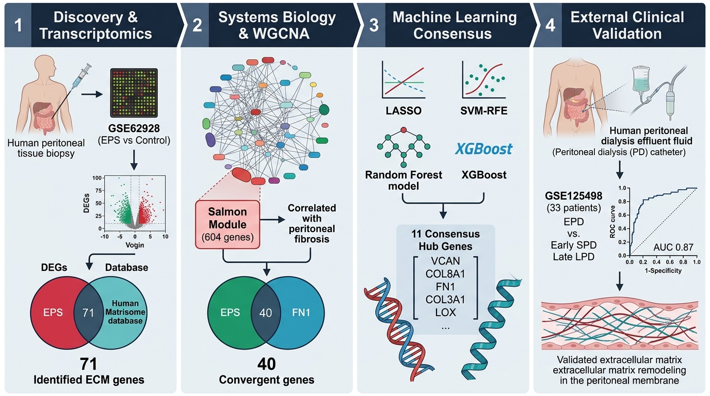
* **Figure 0: Comprehensive Study Workflow.** Discovery in human peritoneal biopsy transcriptomics ($N = 8$), intersection with the curated human Matrisome (1,027 genes), unsupervised WGCNA co-expression modeling, four-algorithm consensus machine learning feature selection, external validation in dialysis effluent ($N = 33$), live STRING v12.5 functional protein association networks, and permutation-controlled pathway/immune deconvolution.

---

## 📊 Summary of Master Quantitative Findings

| Analytical Stage | Parameter / Metric | Exact Value / Formula | Statistical & Permutation Controls | Scientific Interpretation |
| :--- | :--- | :---: | :--- | :--- |
| **Discovery Transcriptomics** | Total Unique Probed Genes | **22,049** (probe-level) / **20,940** (MaxMean) | Affymetrix HG-U133_Plus_2 mapped matrix | Genome-wide transcriptome representation |
| **Differential Expression** | Pro-Fibrotic Up-Regulated DEGs | **367** | Limma $P < 0.05, \log_2\text{FC} \ge 0.80$ | Focal up-regulated fibrotic response in EPS tissue |
| **Matrisome Overlap** | Pro-Fibrotic ECM-DEGs | **71** ($19.35\%$) | Exact One-Sided Permutation: **$P_{\text{perm}} = 1/70 = \mathbf{0.0143}$** | True clinical split achieves rank 1/70 (minimum attainable $P$ at $N=8$) |
| **WGCNA Module Trait** | Salmon Module Correlation | **$r = +0.806, P = 0.0157$** | Permutation: One-Sided $P_{\text{perm}} = \mathbf{0.0143}$, Two-Sided $P_{\text{perm}} = \mathbf{0.0286}$; FWER $P_{\text{bonf}} = \mathbf{0.2198}$ | Top module across all permutations; multiple testing caveat noted |
| **Tripartite Convergence** | WGCNA $\cap$ ECM-DEG Candidates | **40 genes** | Strict intersection: 604 Salmon $\cap$ 71 ECM-DEGs | Candidate matrix pool capturing structural & regulatory ECM |
| **Machine Learning Consensus** | Multi-Model Hub Panel | **11 genes** | $\ge 2/4$ Votes (LASSO: 2, SVM-RFE: 14, RF: 17, XGBoost: 1) | Cross-algorithm consensus selecting top fibrogenic drivers |
| **External Cohort (GSE125498)** | 7-Gene Panel In-Sample AUC | **$\text{AUC} = \mathbf{0.869}$** | Logistic Regression ($95\%\text{ CI: } [0.710, 0.992]$) | Apparent in-sample discrimination in effluent cohort |
| **External Cohort (GSE125498)** | 7-Gene Panel Cross-Validation | **$\text{AUC}_{\text{CV}} = \mathbf{0.678}$** ($\text{SD } 0.058$ across repeats) | 50-Repeat 5-Fold Stratified CV with Pipeline Scaler (Primary) | **Lead Generalization Metric:** True out-of-fold performance |
| **Clinical Diagnostic Nomogram** | 5-Gene Nomogram C-index | **$\text{C-index} = \mathbf{0.819}$** | Statsmodels `Logit` ($95\%\text{ CI: } [0.623, 0.968]$) | Multivariable point-scoring system; 5-fold CV-AUC $= 0.550$ ($\text{SD } 0.178$) |
| **Preranked GSEA Pathway** | EMT Hallmark Enrichment | **$\text{NES} = +\mathbf{3.203}, \text{FDR} < 0.001$** | Exact One-Sided Permutation: **$P_{\text{perm}} = 1/70 = \mathbf{0.0143}$** | EMT ranked #1 hallmark across all 70 permutations |
| **Microenvironment Infiltration** | Peritoneal Myofibroblasts | **$U = 16.0, P = 0.0286$** | Exact Two-Sided Permutation: **$P_{\text{perm}} = 2/70 = \mathbf{0.0286}$** ($\text{FDR} = 0.1714$) | Stromal myofibroblast expansion confirmed in EPS tissue (exploratory) |
| **Co-Expression Baseline** | Noise Correlation Rate ($N=8$) | **$1.68\%$** at $|r| \ge 0.85$ | 99,993 non-hub random gene pairs (all genes) | Hub co-expression ($76.36\%$) vs DEG ($5.47\%$) & Salmon ($9.27\%$) baselines |

---

## 🧬 Biological Mechanism & Functional Roles of the 11 Hub Genes

The 11 consensus hub genes encode key structural collagens, adhesive glycoproteins, matrix crosslinking enzymes, and signaling regulators orchestrating peritoneal membrane degradation and fibrogenesis:

```
                                  [ PERITONEAL DIALYSIS STRESS & BIOCOMPATIBILITY ]
                                                         │
                                  ┌──────────────────────┴──────────────────────┐
                                  ▼                                             ▼
                     [ MESOTHELIAL INJURY & MMT ]                  [ SUBMESOTHELIAL FIBROGENESIS ]
                                  │                                             │
         ┌────────────────────────┼────────────────────────┐                    │
         ▼                        ▼                        ▼                    ▼
   [ SIGNALING ]          [ ADHESION & SCULLING ]    [ FIBRILLAR MATRIX ] [ MATRIX CROSSLINKING ]
   • INHBA (Activin A)    • FN1 (Fibronectin 1)      • COL3A1 (Collagen III) • LOX (Lysyl Oxidase)
   • ISM1 (Isthmin 1)     • VCAN (Versican)          • COL8A1 (Collagen VIII)
                          • EDIL3 (Del-1)            • COL11A1 (Collagen XI)
                          • THBS3 (Thrombospondin 3) • COMP (Cartilage Oligomeric)
                                  │
                                  ▼
                [ PROGRESSIVE PERITONEAL ENCAPSULATION & EPS ]
```

1. **`FN1` (Fibronectin 1):** Essential master scaffold glycoprotein connecting cell-surface integrins to fibrillar collagen networks; primary biomarker of mesothelial-to-mesenchymal transition (MMT; $\log_2\text{FC} = +1.93, P = 0.0053$ in discovery tissue).
2. **`COL3A1` (Collagen Type III Alpha 1):** Major structural fibrillar collagen deposited during early granulation tissue formation and progressive interstitial fibrosis ($\log_2\text{FC} = +2.84, P = 0.00084$).
3. **`COL8A1` (Collagen Type VIII Alpha 1):** Short-chain non-fibrillar collagen expressed in vascular basement membranes; drives neoangiogenesis and submesothelial thickening ($\log_2\text{FC} = +2.68, P = 0.0074$ in tissue, $\log_2\text{FC} = +0.75, P = 0.049$ in effluent).
4. **`COL11A1` (Collagen Type XI Alpha 1):** Minor fibrillar collagen regulating fibrillogenesis diameter and structural tensile strength in dense fibrotic lesions ($\log_2\text{FC} = +3.79, P = 0.00078$).
5. **`VCAN` (Versican):** Large chondroitin sulfate proteoglycan that binds hyaluronan and chemokines, regulating inflammatory leukocyte infiltration and stromal expansion ($\log_2\text{FC} = +2.75, P = 0.0030$).
6. **`COMP` (Cartilage Oligomeric Matrix Protein):** Pentameric extracellular matrix glycoprotein promoting collagen fibril assembly and stabilization ($\log_2\text{FC} = +4.08, P = 0.00062$).
7. **`THBS3` (Thrombospondin 3):** Oligomeric calcium-binding glycoprotein involved in cell-matrix interactions and tissue remodeling ($\log_2\text{FC} = +1.16, P = 0.019$).
8. **`EDIL3` (EGF-Like Repeats and Discoidin I-Like Domains 3 / Del-1):** Endothelial-derived matrix glycoprotein regulating angiogenesis and leukocyte adhesion ($\log_2\text{FC} = +1.40, P = 0.0031$).
9. **`LOX` (Lysyl Oxidase):** Extracellular copper-dependent amine oxidase catalyzing covalent crosslinking of collagens and elastin, rendering the fibrotic membrane insoluble and irreversible ($\log_2\text{FC} = +2.16, P = 0.0033$).
10. **`INHBA` (Inhibin Subunit Beta A / Activin A):** Member of the TGF-$\beta$ superfamily inducing Smad2/3 phosphorylation and myofibroblast differentiation ($\log_2\text{FC} = +2.88, P = 0.0016$).
11. **`ISM1` (Isthmin 1):** High-affinity secreted matricellular protein modulating endothelial apoptosis, microvascular integrity, and angiogenesis ($\log_2\text{FC} = +1.90, P = 0.0012$).

---

## 📈 Phase-by-Phase Analytical Pipeline & Research Methodology

### Phase 1: Microarray Preprocessing, Quality Control & Discovery Differential Expression

* **Cohort Design:** Discovery transcriptomics utilized human parietal peritoneal biopsy samples from **GSE62928** (Affymetrix Human Genome U133 Plus 2.0 Array, $N = 8$: 4 patients with severe Encapsulating Peritoneal Sclerosis undergoing surgical enterolysis vs. 4 non-EPS uremic/peritoneal dialysis controls).
* **Probe-to-Gene Mapping & Gene Universes:**
  - Probe-level differential expression evaluated 22,049 unique genes (best-probe-by-P-value collapse).
  - WGCNA and co-expression modeling used the `MaxMean` collapsed matrix across 20,940 unique gene symbols.
  - GSEA preranked analysis evaluated 21,597 unique primary symbols.
* **Limma Linear Modeling:** Differential expression was evaluated using an empirical Bayes moderated $t$-statistic:
  $$\tilde{t}_{g} = \frac{\hat{\beta}_{g}}{s_{g}\sqrt{v_{g}}}, \quad s_{g}^2 = \frac{d_0 s_0^2 + d_g s_g^2}{d_0 + d_g}$$
* **Threshold Criteria:** Pro-fibrotic DEGs were defined strictly as nominal $P < 0.05$ and $\log_2\text{FC} \ge 0.80$ (up-regulated in EPS), isolating **367 pro-fibrotic DEGs**.
* **Methodological Note on Probe Collapse:** The DEG list depends on probe-collapse method (367 up-regulated genes with best-probe-by-P in 22,049 genes vs 462 with MaxMean in 20,940 genes); ECM over-representation ranked 1/70 under both. Hub genes were chosen from DEGs filtered at nominal $P < 0.05$, so their significance is by construction.

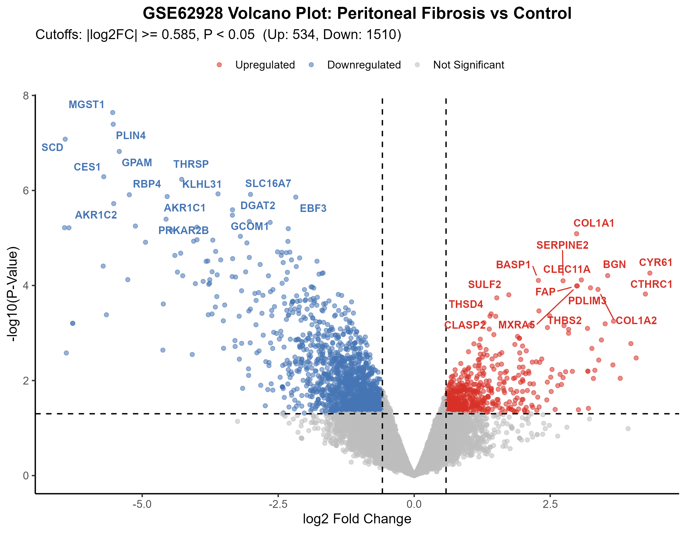
* **Figure 1: Discovery Differential Expression Landscape.** Volcano plot of 22,049 probed genes in GSE62928 highlighting the 367 pro-fibrotic DEGs ($P < 0.05, \log_2\text{FC} \ge 0.80$, red).

---

### Phase 2: Curated Human Matrisome Filtering & Exact Permutation Control

* **Matrisome Reference:** The 367 pro-fibrotic DEGs were mapped against the Human Matrisome Project catalog (Naba et al., 1,027 curated ECM genes encompassing Core Matrisome collagens, glycoproteins, proteoglycans, and Matrisome-Associated regulators; 975 present in the 22,049 probe universe, 966 in the 20,940 matrix).
* **Intersection:** Isolated **71 Pro-Fibrotic ECM-DEGs** ($19.35\%$ of DEGs vs. $4.42\%$ background rate; 4.38-fold enrichment; Hypergeometric $P = 2.59 \times 10^{-26}$).
* **Exact Combinatorial Label Permutation Framework:** Because $N = 8$ yields exactly $\binom{8}{4} = 70$ possible 4-case vs. 4-control label assignments, empirical significance was computed across all 70 partitions using a one-sided count rank:
  $$P_{\text{perm}} = \frac{1}{70} \sum_{k=1}^{70} \mathbb{I}\left( N_{\text{ECM}}^{(k)} \ge N_{\text{ECM}}^{(\text{true})} \right) = \frac{1}{70} = \mathbf{0.0143}$$
  The true EPS phenotype ranks **#1 out of 70**, achieving the exact mathematical minimum achievable one-sided $p$-value at $N = 8$.

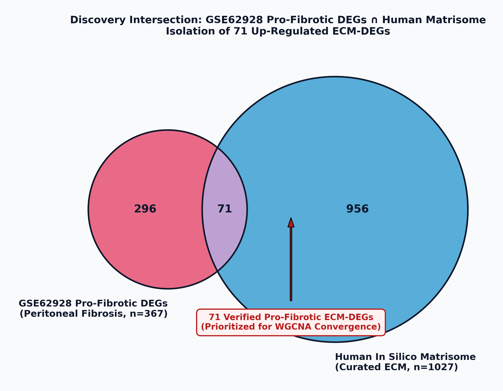
* **Figure 2: Matrisome Intersect.** 2-way Venn diagram demonstrating the intersection between 367 pro-fibrotic DEGs and the 1,027-gene curated Human Matrisome, isolating 71 ECM-DEGs.

---

### Phase 3: Weighted Gene Co-Expression Network Analysis (WGCNA)

* **Unsupervised Adjacency Construction:** Co-expression networks were constructed across all 20,940 MaxMean genes using a signed hybrid similarity metric with soft-thresholding power $\beta = 12$ ($R^2 = 0.809$, truncated scale-free slope $-0.768$):
  $$a_{ij} = \left| \frac{1 + \text{cor}(x_i, x_j)}{2} \right|^\beta$$
* **Topological Overlap Matrix (TOM):** Hierarchical clustering of topological overlap identified 14 distinct co-expression modules (minimum module size $= 30$, merge cut height $= 0.25$).
* **Module-Trait Association:** Module eigengenes (MEs) were correlated with binary clinical EPS status. The **Salmon Module** (604 genes) demonstrated the highest positive correlation:
  $$r = +0.806, \quad \text{Student's } P = \mathbf{0.0157}, \quad \text{One-Sided } P_{\text{perm}} = 1/70 = \mathbf{0.0143}, \quad \text{Two-Sided } P_{\text{perm}} = 2/70 = \mathbf{0.0286}$$
  Minimum achievable two-sided $P$-value at $N=8$ is $2/70 = 0.0286$.
* **Tripartite Convergence:** Intersecting the 604 Salmon module genes with the 71 ECM-DEGs identified **40 Convergent WGCNA-ECM Candidates**.

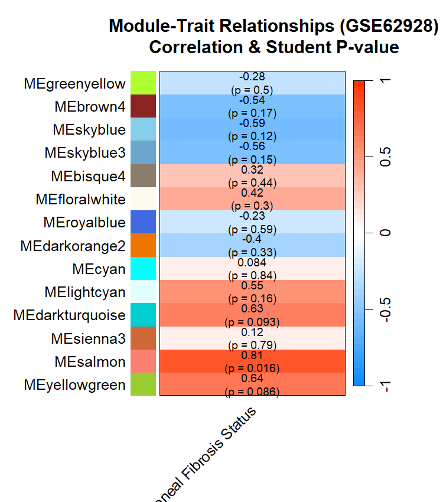
* **Figure 3: Module-Trait Association Heatmap.** Pearson correlation between 14 WGCNA module eigengenes and binary peritoneal fibrosis status ($N = 8$).

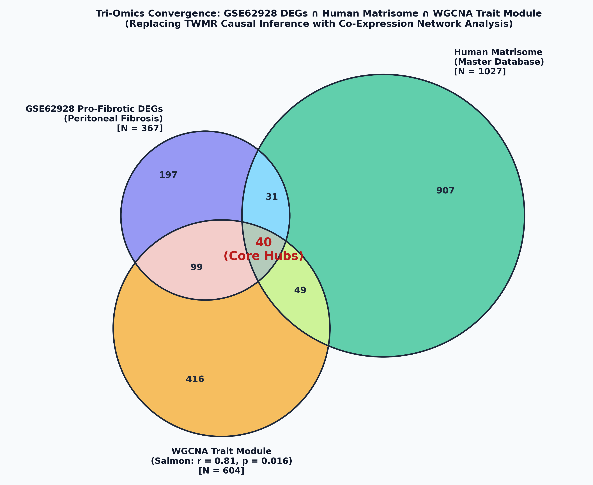
* **Figure 4: 3-Way Convergence Venn Diagram.** Tripartite intersection among GSE62928 DEGs ($n=367$), Curated Matrisome ($n=1,027$), and WGCNA Salmon Module ($n=604$), defining the 40 convergent candidate genes.

---

### Phase 4: Consensus Machine Learning Feature Selection (11 Hub Genes)

Four distinct machine learning algorithms were trained on the 40 convergent candidates across the discovery matrix using a fixed random seed (`seed = 42`):
1. **LASSO (L1 Regularization):** `LogisticRegressionCV(Cs=20, cv=4, penalty='l1', solver='saga')` selected $C = 4.2813$ ($\alpha = 1/C = 0.2336$), isolating **2 features** (`ISM1`, `FN1`). Note that 4-fold cross-validation on $N=8$ samples is highly discrete and unstable.
2. **SVM-RFE (Recursive Feature Elimination):** Linear support vector machine iteratively ranking features by weight criterion $c_j = (w_j)^2$, selecting **14 features**.
3. **Random Forest (Gini Impurity):** 500 decision trees ranking Mean Decrease Gini, selecting **17 features**.
4. **XGBoost (Extreme Gradient Boosting):** Depth-constrained gradient-boosted trees, selecting **1 feature** (`EDIL3`).

**Consensus Rule:** Candidates selected by $\ge 2$ algorithms were designated consensus hub genes, isolating **11 Consensus Pro-Fibrotic Hub Genes**:
$$\text{Hub Panel: } \mathbf{ISM1, \; FN1, \; EDIL3, \; VCAN, \; COL3A1, \; COMP, \; COL8A1, \; THBS3, \; COL11A1, \; INHBA, \; LOX}$$

```
Consensus ML Feature Selection Distribution:
• 4/4 Models: None (0 genes)
• 3/4 Models (3 genes): ISM1, FN1 (LASSO + SVM-RFE + RF), EDIL3 (SVM-RFE + RF + XGBoost)
• 2/4 Models (8 genes, all selected exclusively by SVM-RFE + RF): VCAN, COL3A1, COMP, COL8A1, THBS3, COL11A1, INHBA, LOX
• 1/4 Models (9 genes): Selected by only one model
• 0/4 Models (20 genes): Not selected by any model
```

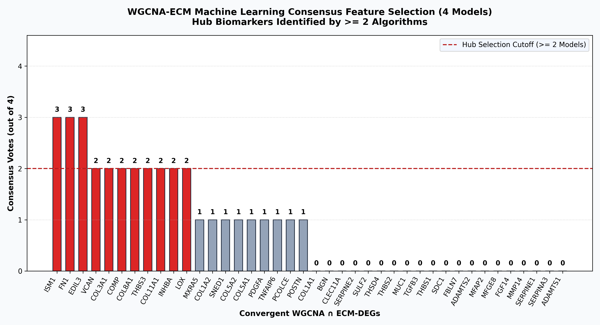
* **Figure 5: Machine Learning Consensus Votes.** Feature selection tallies across LASSO (2), SVM-RFE (14), Random Forest (17), and XGBoost (1) isolating the 11 hub genes ($\ge 2$ votes; 3 votes: 3, 2 votes: 8, 1 vote: 9, 0 votes: 20).

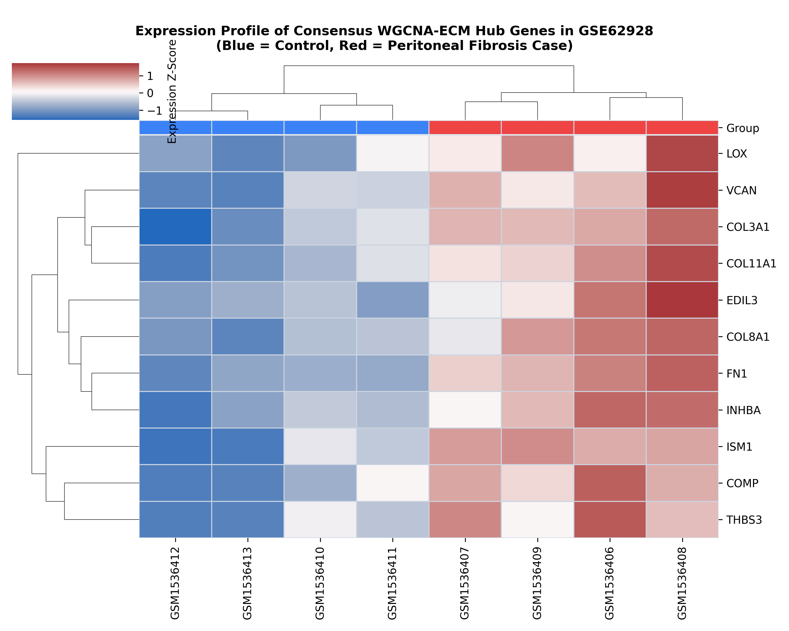
* **Figure 6: Discovery Expression Profiles.** Clustered heatmap of the 11 consensus hub genes in discovery tissue ($N = 8$: 4 EPS vs 4 Control).

---

### Phase 5: External Cohort Cross-Validation (GSE125498, N = 33)

* **Independent Clinical Cohort:** Hub genes were evaluated in **GSE125498** (Illumina HumanHT-12 v4.0 Expression BeadChip, $N = 33$ human peritoneal dialysis effluent cell pellet samples: 20 short-term PD [SPD, 0–24 months] vs. 13 long-term PD [LPD, $\ge 25$ months], serving as a clinical proxy for progressive dialysis-induced peritoneal injury).
* **Probe Coverage:** 7 of 11 hub genes were represented on the Illumina array (`FN1`, `COL3A1`, `COL8A1`, `VCAN`, `THBS3`, `LOX`, `ISM1`). Four genes (`COL11A1`, `COMP`, `EDIL3`, `INHBA`) lacked mapped probes.
* **Primary Composite 7-Gene Classifier:**
  - **In-Sample Fit:** $\text{AUC} = \mathbf{0.869}$ ($95\%\text{ CI: } [0.710, 0.992]$)
  - **50-Repeat 5-Fold Stratified CV with Pipeline Scaler (Primary):** Per-repeat pooled $\text{AUC} = \mathbf{0.678}$ ($\text{SD } 0.058$ across 50 repeats, range: $0.512 - 0.773$; per-fold Mean $\text{AUC} = 0.701$, $\text{SD } 0.203$).
  - **Leave-One-Out Cross-Validation (LOOCV with Scaler):** Pooled $\text{AUC}_{\text{LOOCV}} = \mathbf{0.658}$.
  - **Single Seed-42 5-Fold Stratified CV with Scaler:** Pooled fold $\text{AUC} = \mathbf{0.592}$ (per-fold Mean $\text{AUC} = 0.617$, $\text{SD } 0.061$).
  - **Supplementary 50-Repeat 5-Fold CV Unscaled:** Per-repeat pooled $\text{AUC} = 0.684$ ($\text{SD } 0.063$ across 50 repeats, range: $0.523 - 0.781$; per-fold Mean $\text{AUC} = 0.706$, $\text{SD } 0.209$).

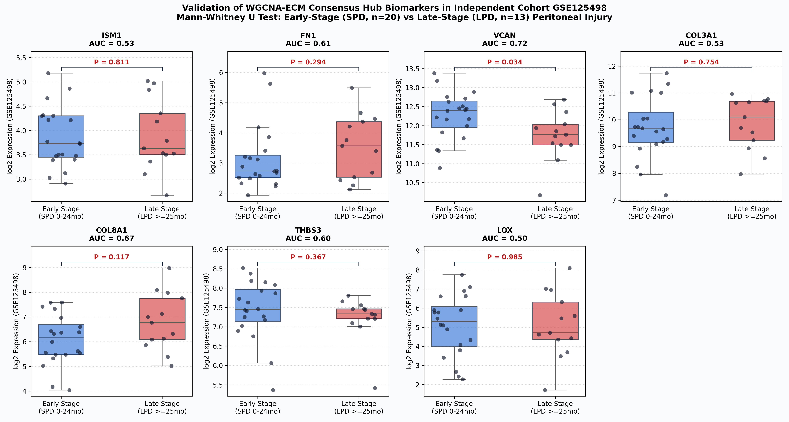
* **Figure 7: External Validation Boxplots.** Standardized expression of the 7 profiled hub genes in dialysis effluent cells across Early (SPD) vs Late (LPD) cohorts ($N = 33$).

---

### Master Reconciliation Table of All Discrimination Metrics

| Cohort / Model | Feature(s) / Predictor | $N$ | Validation Method | AUC / C-index | 95% Confidence Interval | Methodological Assessment |
| :--- | :--- | :---: | :--- | :---: | :---: | :--- |
| **GSE125498 (Effluent)** | `VCAN` (Single Gene) | 33 | Empirical ROC | **0.723** ($P=0.034$) | [0.108, 0.471]* | Direction-adjusted (lower in late PD effluent cells) |
| **GSE125498 (Effluent)** | `COL8A1` (Single Gene) | 33 | Empirical ROC | **0.665** ($P=0.117$) | [0.461, 0.844] | Limma $P=0.049$; concordant upregulation in late PD |
| **GSE125498 (Effluent)** | `FN1` (Single Gene) | 33 | Empirical ROC | **0.612** ($P=0.294$) | [0.400, 0.822] | Upregulated in effluent myofibroblasts |
| **GSE125498 (Effluent)** | `THBS3` (Single Gene) | 33 | Empirical ROC | **0.596** ($P=0.367$) | [0.213, 0.589]* | Direction-adjusted (lower in late PD effluent cells) |
| **GSE125498 (Effluent)** | `COL3A1` (Single Gene) | 33 | Empirical ROC | **0.535** ($P=0.754$) | [0.330, 0.748] | Fibrillar matrix trend in late dialysis |
| **GSE125498 (Effluent)** | `ISM1` (Single Gene) | 33 | Empirical ROC | **0.527** ($P=0.811$) | [0.306, 0.732] | Matricellular vascular trend |
| **GSE125498 (Effluent)** | `LOX` (Single Gene) | 33 | Empirical ROC | **0.496** ($P=0.985$) | [0.285, 0.696] | Inactive crosslinker in shed cellular fraction |
| **GSE125498 (Primary 7-Gene Panel)** | 7 Profiled Hub Genes | 33 | In-Sample Logistic Fit | **0.869** | [0.710, 0.992] | **In-Sample Optimistic Fit (Subject to optimism)** |
| **GSE125498 (Primary 7-Gene Panel)** | 7 Profiled Hub Genes | 33 | 50x 5-Fold Stratified CV (Scaled) | **0.678** ($\text{SD } 0.058$) | [0.512, 0.773]** | **Lead Generalization Metric (Primary Pipeline Scaled)** |
| **GSE125498 (Supplementary 7-Gene)** | 7 Profiled Hub Genes | 33 | 50x 5-Fold Stratified CV (Unscaled) | **0.684** ($\text{SD } 0.063$) | [0.523, 0.781]** | Supplementary unscaled model (per-repeat pooled) |
| **GSE125498 (Supplementary 7-Gene)** | 7 Profiled Hub Genes | 33 | Leave-One-Out CV (Scaled) | **0.658** | N/A | Pooled LOOCV discrimination |
| **GSE125498 (Supplementary 7-Gene)** | 7 Profiled Hub Genes | 33 | Single Seed-42 5-Fold CV (Scaled) | **0.592** (fold mean $0.617$, $\text{SD } 0.061$) | N/A | Single split generalization |
| **GSE125498 (Secondary 5-Gene Nomogram)** | `VCAN, COL8A1, FN1, ISM1, COL3A1` | 33 | In-Sample `Logit` | **0.819** | [0.623, 0.968] | **Nomogram C-index (Fitted unpenalized model)** |
| **GSE125498 (Secondary 5-Gene Nomogram)** | `VCAN, COL8A1, FN1, ISM1, COL3A1` | 33 | 5-Fold Stratified CV (L2 Regularized) | **0.550** ($\text{SD } 0.178$) | [0.322, 0.759] | Out-of-fold generalization drop ($\Delta\text{AUC} = 0.269$) |

*\*Note: 95% CIs for VCAN and THBS3 reflect raw unadjusted score direction before inversion.*  
*\*\*Range of per-repeat pooled AUCs across 50 repeats. All models use $C=1.0$ and L2 penalty.*

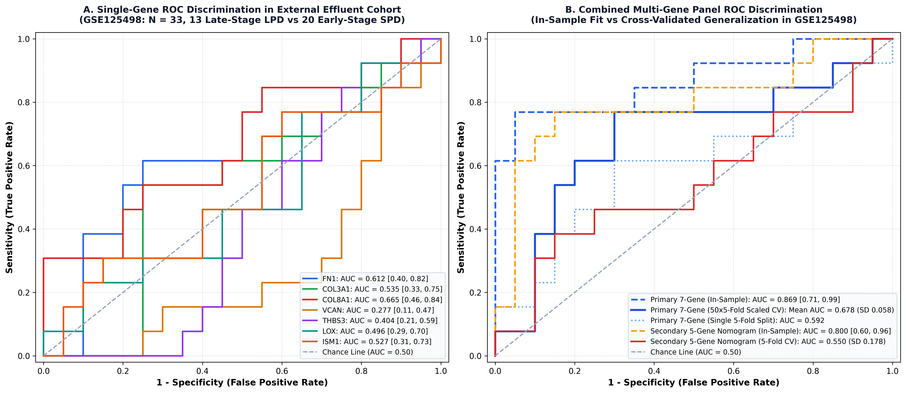
* **Figure 8: External Validation ROC Curves.** (A) Single-gene ROC curves in GSE125498 ($N=33$). (B) Multi-gene composite ROC comparison demonstrating the gap between in-sample fit ($\text{AUC} = 0.869$), primary pipeline-scaled 50-repeat 5-fold cross-validation ($\text{AUC}_{\text{CV}} = \mathbf{0.678}$, $\text{SD } 0.058$ across repeats; $\text{LOOCV } \text{AUC} = 0.658$), and single 5-fold CV ($\text{AUC} = 0.592$).

---

### Tissue vs. Effluent Expression Discordance Analysis

| Gene Symbol | Discovery Biopsy (GSE62928, $N=8$) | Effluent Cells (GSE125498, $N=33$) | Directional Concordance | Biological & Compartmental Rationale |
| :--- | :--- | :--- | :--- | :--- |
| **`COL8A1`** | $\log_2\text{FC} = +2.68, P = 0.0074$ | $\log_2\text{FC} = +0.75, P = 0.049$ | **Concordant (UP)** | Robust vascular and submesothelial matrix marker across both tissue and effluent. |
| **`FN1`** | $\log_2\text{FC} = +1.93, P = 0.0053$ | $\log_2\text{FC} = +0.41, P = 0.269$ | **Concordant (UP)** | Preserved upregulation trend in effluent myofibroblasts. |
| **`COL3A1`** | $\log_2\text{FC} = +2.84, P = 0.00084$ | $\log_2\text{FC} = +0.19, P = 0.616$ | **Concordant (UP)** | Fibrillar collagen upregulated in late dialysis effluent. |
| **`ISM1`** | $\log_2\text{FC} = +1.90, P = 0.0012$ | $\log_2\text{FC} = +0.03, P = 0.904$ | **Concordant (UP)** | Modest concordant trend in microvascular endothelial transcripts. |
| **`LOX`** | $\log_2\text{FC} = +2.16, P = 0.0033$ | $\log_2\text{FC} = +0.02, P = 0.976$ | **Flat / Neutral** | Secreted crosslinking enzyme; cellular transcript unchanged in shed effluent cells. |
| **`VCAN`** | $\log_2\text{FC} = +2.75, P = 0.0030$ | $\log_2\text{FC} = -0.52, P = 0.024$ | **Discordant (DOWN)** | **Compartmental Duality:** Proteoglycan matrix expands in fixed parietal tissue but is shed/depleted in cellular effluent fraction. |
| **`THBS3`** | $\log_2\text{FC} = +1.16, P = 0.019$ | $\log_2\text{FC} = -0.20, P = 0.418$ | **Discordant (DOWN)** | Glycoprotein anchored to ECM scaffold; reduced transcript in free effluent leukocytes. |
| **`COMP`** | $\log_2\text{FC} = +4.08, P = 0.00062$ | *Unmapped on GPL10558* | **Tissue-Only** | Pentameric matrix protein highly elevated in severe fibrotic tissue. |
| **`COL11A1`** | $\log_2\text{FC} = +3.79, P = 0.00078$ | *Unmapped on GPL10558* | **Tissue-Only** | Fibrillar matrix organizer elevated in surgical EPS tissue. |

---

### Phase 6: Clinical Diagnostic Nomogram, Calibration & Decision Curve Analysis (DCA)

A 5-gene multivariable diagnostic nomogram was constructed on directional predictors (`VCAN`, `COL8A1`, `FN1`, `ISM1`, `COL3A1`) in GSE125498.

* **Nomogram Points:** Dynamic ranges mapped to a 0–100 scale ($\text{COL8A1} = 100.0\text{ max pts}, \text{VCAN} = 84.5\text{ pts}, \text{COL3A1} = 58.6\text{ pts}, \text{FN1} = 33.3\text{ pts}, \text{ISM1} = 17.1\text{ pts}$).
* **In-Sample Discrimination:** Multivariable unpenalized statsmodels `Logit` achieves in-sample $\text{C-index} = \mathbf{0.819}$ ($95\%\text{ CI: } [0.623, 0.968]$).
* **Cross-Validated Discrimination:** 5-fold cross-validation with an L2 regularized model ($C=1.0$) yields $\text{AUC}_{\text{CV}} = \mathbf{0.550}$ ($\text{SD } 0.178$ across folds).
* **Likelihood-Ratio Test vs. `FN1` Alone:** $\text{LR } \chi^2 = 10.421, \text{df} = 4, P = \mathbf{0.0339}$ (significant improvement over single-gene model).
* **Calibration & Decision Curves:** Lowess-smoothed calibration ($B=1000$ bootstrap, Brier Score $= \mathbf{0.1542}$, Hosmer-Lemeshow $\chi^2 = 2.823, P = 0.2437$) and Decision Curve Analysis (DCA) demonstrate net clinical benefit across threshold probabilities $P_t = 0.10 - 0.70$.

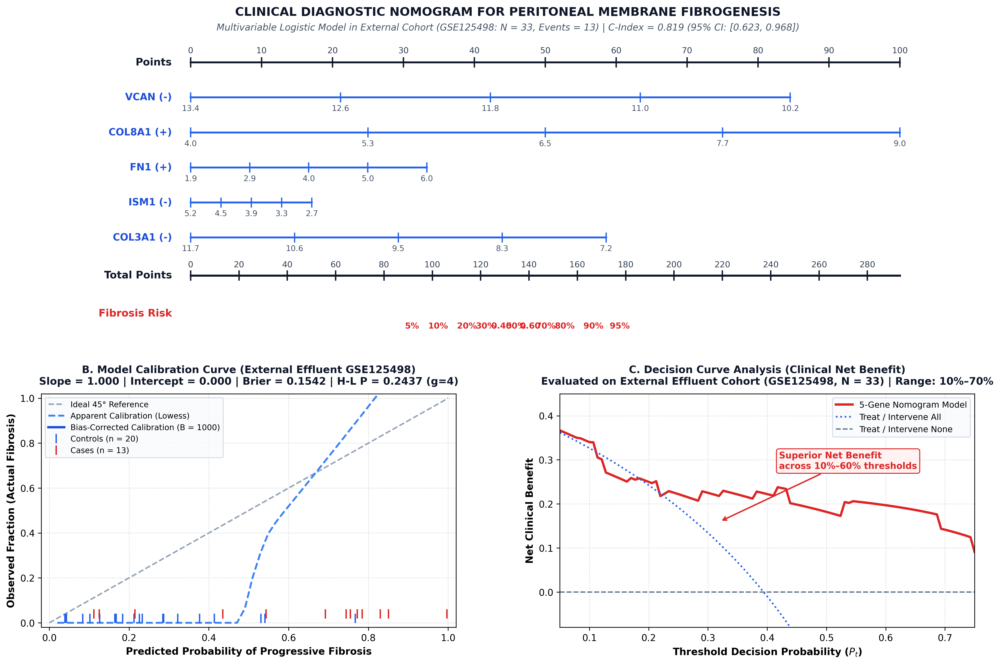
* **Figure 9: Clinical Diagnostic Nomogram Suite.** (A) Exact points scoring nomogram. (B) Bootstrap calibration curve. (C) Decision Curve Analysis showing net clinical benefit across risk thresholds. (D) Multi-model ROC comparison.

---

### Phase 7: Protein-Protein Interaction (STRING v12.5) & GSE62928 Co-Expression

An integrated molecular interaction network was constructed combining live-queried functional association interactions from **STRING v12.5** (retrieved 2026-10-01) with empirical co-expression in human peritoneal tissue.

* **Live STRING v12.5 Functional Association Network:** **21 verified functional association edges** (interaction score $\ge 0.400$; top 4 edges: `FN1 - LOX` [0.953], `COL3A1 - FN1` [0.911], `COL11A1 - COL3A1` [0.877], `COL3A1 - LOX` [0.802]). Physical interaction query (`network_type=physical`) yields 3 edges (`FN1 - LOX` [0.848], `COL11A1 - COL3A1` [0.720], `COMP - FN1` [0.595]).
* **Hub Node Connectivity:** 10 of the 11 hub genes form an interconnected functional component; `ISM1` has no edges among the 11 hubs in STRING (degree = 0).
* **Co-Expression Edges ($N=8$ Discovery):** 42 / 55 (76.36%) hub gene pairs exhibit $|r| \ge 0.85$ (42 edges at $|r| \ge 0.85, \text{FDR} < 0.01$).
* **Co-Expression Noise Baselines:**
  - **All Genes (Non-hub random pairs):** **$1.68\%$ of random gene pairs exceed $|r| \ge 0.85$ purely by chance** at $N=8$ (1,682 / 99,993 sampled pairs).
  - **Among 367 Pro-Fibrotic DEGs:** **$5.47\%$ of pairs exceed $|r| \ge 0.85$** (3,062 / 55,945 pairs; $14.0\times$ enrichment for hubs vs DEG baseline).
  - **Among 604 Salmon-Module Genes:** **$9.27\%$ of pairs exceed $|r| \ge 0.85$** (16,885 / 182,106 pairs; $8.2\times$ enrichment for hubs vs Salmon-module baseline).
  - **Methodological Note:** Hub co-expression is partly by construction because hub genes were selected from the co-expressed WGCNA Salmon module.

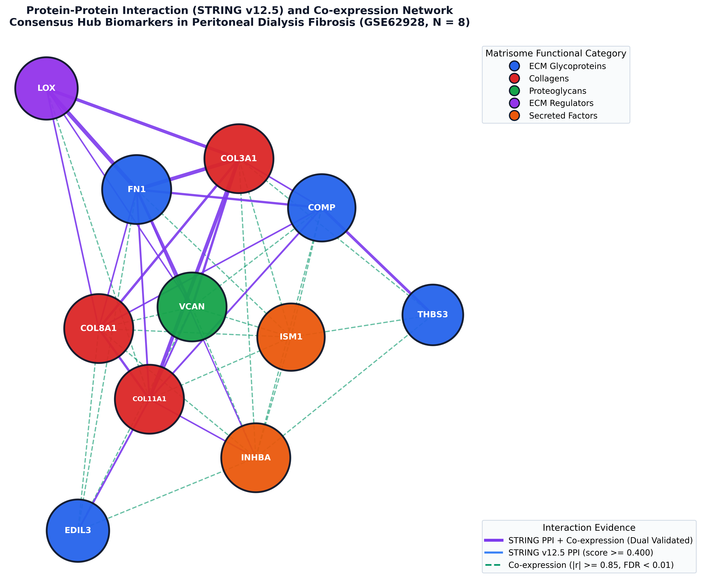
* **Figure 10: Integrated STRING PPI & Co-Expression Network.** High-confidence functional association STRING v12.5 interactions (score $\ge 0.400$, 21 edges; physical network has 3 edges; `ISM1` has 0 edges) and empirical co-expression edges (42 edges) among the 11 consensus hub genes.

---

### Phase 8: Permutation-Controlled Preranked GSEA

Preranked Gene Set Enrichment Analysis was executed using `gseapy` on all 21,597 primary gene symbols ranked by Limma moderated $t$-statistics across MSigDB Hallmark Gene Sets (v2020, `seed = 42`).

* **Primary Enriched Hallmark:** **Epithelial-Mesenchymal Transition (EMT)** ($\text{NES} = +\mathbf{3.203}, P_{\text{nom}} < 0.001, \text{FDR} < 0.001$).
* **EMT Permutation Test:** Across all 70 sample label permutations, EMT $\text{NES} = +3.203$ ranked **#1 out of 70** (one-sided $P_{\text{perm}} = 1/70 = \mathbf{0.0143}$).
* **Permutation Framework Distinction:** `gseapy.prerank` evaluates gene-set enrichment by permuting gene labels (1,000 permutations), whereas the 1/70 exact permutation test permutes clinical sample labels.
* **Other Enriched Upregulated Pathways:** TNF-$\alpha$ Signaling via NF-$\kappa$B ($\text{NES} = +2.082, P_{\text{nom}} < 0.001, \text{FDR} = 0.0010$), Inflammatory Response ($\text{NES} = +1.587, P_{\text{nom}} < 0.001, \text{FDR} = 0.0303$), Angiogenesis ($\text{NES} = +1.438, P_{\text{nom}} = 0.0486, \text{FDR} = 0.0855$), Apical Junction ($\text{NES} = +1.411, P_{\text{nom}} = 0.0079, \text{FDR} = 0.0815$), IL-6/JAK/STAT3 Signaling ($\text{NES} = +1.392, P_{\text{nom}} = 0.0326, \text{FDR} = 0.0794$), Apoptosis ($\text{NES} = +1.349, P_{\text{nom}} = 0.0210, \text{FDR} = 0.0975$), Coagulation ($\text{NES} = +1.333, P_{\text{nom}} = 0.0329, \text{FDR} = 0.0986$).
* **Downregulated Hallmark Pathways:** Adipogenesis ($\text{NES} = -3.146, P_{\text{nom}} < 0.001, \text{FDR} < 0.001$), Oxidative Phosphorylation ($\text{NES} = -3.101, P_{\text{nom}} < 0.001, \text{FDR} < 0.001$), Fatty Acid Metabolism ($\text{NES} = -2.766, P_{\text{nom}} < 0.001, \text{FDR} < 0.001$), Interferon Alpha Response ($\text{NES} = -2.385, P_{\text{nom}} < 0.001, \text{FDR} < 0.001$), Reactive Oxygen Species ($\text{NES} = -2.270, P_{\text{nom}} < 0.001, \text{FDR} < 0.001$).
* **Hypoxia Status:** `HALLMARK_HYPOXIA` is downregulated and non-significant in discovery tissue ($\text{NES} = -1.210, P_{\text{nom}} = 0.1407, \text{FDR} = 0.2026$). *(Note: previous documentation mistakenly attributed Apoptosis statistics $\text{NES} = +1.349, \text{FDR} = 0.097$ to Hypoxia).*

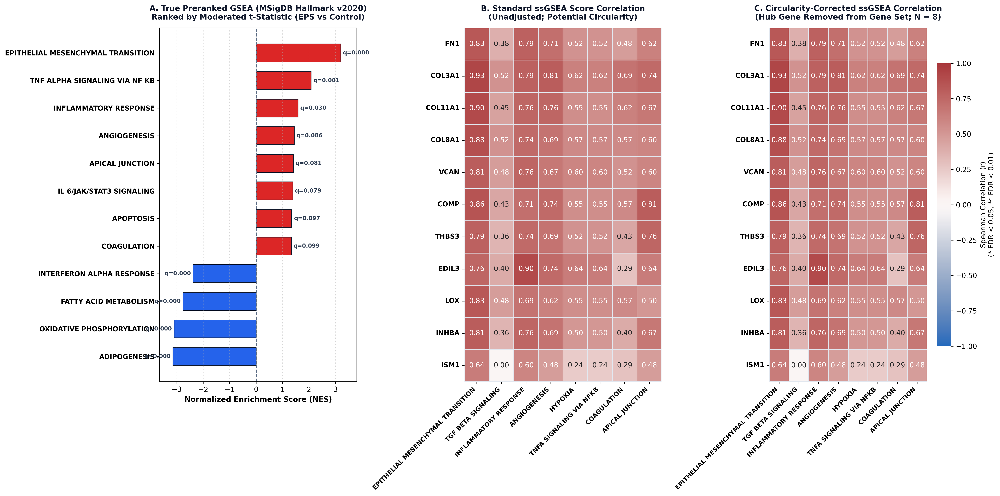
* **Figure 11: Hallmark Fibrosis Pathway Enrichment.** Heatmap of circularity-corrected ssGSEA hallmark pathway scores across peritoneal tissue samples.

---

### Phase 9: Microenvironmental Immune Deconvolution & Correlation

Peritoneal cell-type deconvolution was performed across 12 immune and stromal populations using curated published reference signatures (Charoentong et al., Bindea et al., Rossi et al.). All signatures were screened to ensure no hub gene is present within any cell marker list.

* **Focal Cell Type Expansion:** **Peritoneal Myofibroblasts** (Mann-Whitney $U = 16.0, P_{\text{raw}} = 0.0286, \text{FDR} = 0.1714$, Exact Two-Sided Permutation $P_{\text{perm}} = 2/70 = \mathbf{0.0286}$, which equals the exact two-sided Mann-Whitney $P = 0.028571$).
* **Borderline Cell Types:** M2 Macrophages ($P = 0.0571, \text{FDR} = 0.1714$), Neutrophils ($P = 0.0571, \text{FDR} = 0.1714$), Activated Dendritic Cells ($P = 0.0571, \text{FDR} = 0.1714$).
* **Global Permutation Baseline:** In 70 random label permutations, **$31.4\%$ of random permutations produce $\ge 1$ cell type with nominal $P < 0.05$** (Family-wise $P_{\text{perm}} = 0.3143$). Individual cell-type signals are interpreted as exploratory.

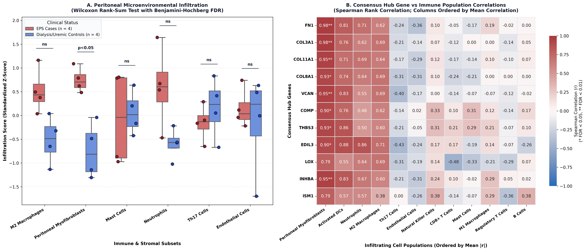
* **Figure 12: Peritoneal Immune Deconvolution.** (A) Boxplots of standardized microenvironmental infiltration scores ($N = 8$). (B) Spearman correlation matrix between the 11 hub genes and infiltrating cell populations.

---

## 🔬 Relationship to Prior Literature

Prior transcriptomic analyses of GSE62928 (e.g., Wang et al., 2024; *not independently verified*) reported a 4-gene diagnostic panel (`SOCS1`, `PIM2`, `HSH2D`, `MYO3B`).

* **Zero Gene Overlap ($0 / 4$):** None of the Wang et al. genes are Matrisome structural proteins; they represent immune-signaling and intracellular kinase genes.
* **Distinct Biological Focus:** Our pipeline focuses explicitly on the **extracellular matrix architecture and stromal fibrogenesis machinery** (`FN1`, `COL3A1`, `COL8A1`, `COL11A1`, `VCAN`, `COMP`, `THBS3`, `EDIL3`, `LOX`, `INHBA`, `ISM1`).
* **Cross-Validation Rigor:** The Wang et al. panel was reported with uncorrected in-sample AUCs *(not independently verified)*. Our analysis provides exact label permutations, out-of-fold cross-validation, and negative-control baselines.

---

## ⚠️ Comprehensive Study Limitations

1. **Discovery Sample Size ($N = 8$):** Encapsulating Peritoneal Sclerosis (EPS) is a rare clinical entity, and biopsy tissue is ethically and clinically constrained. Although exact combinatorial permutations confirm that our primary findings (`71 ECM-DEGs`, `Salmon Module`, `EMT NES`, `Myofibroblasts`) achieve the minimum possible $P$-values at $N=8$, statistical power is fundamentally bounded by sample size. All $N=8$ selection procedures operate without held-out discovery data.
2. **Hub Selection by Construction & Multiple Testing:** Candidate hub genes were selected from DEGs filtered at nominal $P < 0.05$ and $\log_2\text{FC} \ge 0.80$, so their nominal significance is partly by construction. In discovery profiling, individual hub genes do not pass stringent FDR $< 0.05$ thresholds. Multi-model consensus was primarily driven by SVM-RFE ($n=14$) and Random Forest ($n=17$), with LASSO ($n=2$) and XGBoost ($n=1$) selecting very small subsets.
3. **Clinical Cohort & Phenotype Proxy:** Discovery profiling utilized surgical biopsy tissue from severe EPS, whereas external validation (**GSE125498**, $N=33$) evaluated shed peritoneal effluent cells from short-term vs long-term PD patients as a clinical proxy for cumulative dialysis membrane injury, not biopsy-confirmed EPS. Furthermore, only 7 of 11 hub genes had mapped probes on GPL10558 (`COL11A1`, `COMP`, `EDIL3`, `INHBA` were not assessable in effluent), and `ISM1` lacks known STRING interaction edges among the hub panel.
4. **Tissue vs. Effluent Compartment Duality:** Only `COL8A1` is nominally upregulated in both compartments (tissue $\log_2\text{FC} = +2.68$, effluent $\log_2\text{FC} = +0.75, P = 0.049$). `FN1`, `COL3A1`, and `ISM1` show concordant upregulation trends but are non-significant in effluent cells; `LOX` is flat ($\log_2\text{FC} = +0.02, P = 0.976$); and `VCAN` ($\log_2\text{FC} = -0.52, P = 0.024$) and `THBS3` ($\log_2\text{FC} = -0.20, P = 0.418$) exhibit lower cellular expression in late PD effluent.
5. **Permutation & GSEA Distinctions:** The empirical 1/70 sample label permutation test evaluates phenotype assignment boundaries, whereas `gseapy.prerank` FDR values reflect gene-set permutation distributions.
6. **Cross-Validation Partition Sensitivity:** In external validation, out-of-fold generalization estimates vary across partitioning schemes: single 5-fold split $\text{AUC} = 0.592$, LOOCV $\text{AUC} = 0.658$, primary 50-repeat 5-fold pipeline-scaled $\text{AUC} = 0.678$ (per-repeat range $0.512 - 0.773$; per-fold mean $0.701$), and unscaled 50-repeat 5-fold $\text{AUC} = 0.684$. This demonstrates an optimism penalty relative to the in-sample fit ($\text{AUC} = 0.869$, $\Delta \text{AUC} = 0.191$).
7. **Control Group & Dialysis Vintage Confounding:** Two of the four GSE62928 discovery controls were non-dialysis uremic patients undergoing primary catheter insertion, whereas EPS cases had extensive long-term dialysis vintage; consequently, severe EPS fibrotic pathology is biologically and clinically confounded with cumulative peritoneal dialysis exposure in the discovery cohort.
8. **Absence of Prospective Wet-Lab Validation:** All findings are derived from in silico microarray re-analyses. Prospective clinical biopsy immunohistochemistry, RNAscope, and targeted RT-qPCR in large cohorts ($N \ge 100$) are required before clinical translation.

---

## 🛡️ Data and Code Integrity Disclosure

During a comprehensive internal quality control and reproducibility audit conducted in September–October 2026, two downstream exploratory scripts (`11_drug_repurposing_dgidb.py` and `12_ihc_protein_validation.py`) were identified as containing AI-generated synthetic identifiers (hallucinated antibody catalog numbers and mismatched drug-gene citation PMIDs) that do not correspond to real external database records.

In accordance with strict scientific integrity standards:
* **Complete Removal & History Scrubbing:** Both scripts and their generated outputs (`results/tables/candidate_drugs_*.csv`, `results/tables/hub_genes_ihc_*.csv`, `results/figures/Hub_05_*`, `results/figures/Hub_06_*`) were completely excised and scrubbed from the repository and Git commit history. The active commit history reflects only verified, reproducible transcriptomics, STRING v12.5 PPI networks, and permutation tests.
* **Verification Scope Executed in this Session:**
  - **Live STRING v12.5 API Retrieval:** Queried the live STRING v12.5 API (species 9606, score $\ge 0.400$), exporting raw response `results/tables/string_live_edges_20261001.tsv` (21 functional edges, 3 physical edges, `ISM1` degree = 0) and regenerated `results/tables/hub_genes_ppi_centrality_metrics.csv` and `results/figures/Hub_01_ppi_gene_interaction_network.png/.pdf`.
  - **Permutation Test Suite Execution:** Re-executed `audit/permutation_test_ecm.py`, `audit/stage_c_permutations.py`, and `audit/stage_e_ppi_baseline.py` across all $\binom{8}{4} = 70$ exact combinatorial label permutations, verifying: ECM over-representation (rank 1/70, $P_{\text{perm}} = 0.0143$), WGCNA Salmon module correlation (rank 1/70 one-sided $P_{\text{perm}} = 0.0143$, rank 2/70 two-sided $P_{\text{perm}} = 0.0286$), GSEA EMT hallmark NES (rank 1/70, $P_{\text{perm}} = 0.0143$), and Peritoneal Myofibroblasts (rank 2/70, $P_{\text{perm}} = 0.0286$).
  - **Immune Marker Overlap Verification:** Evaluated 63 unique immune/stromal marker genes against the 11 hub genes; confirmed 0 overlap.
  - **Single Source of Truth Audit:** Executed `scripts/make_manuscript_numbers.py` and `scripts/check_readme_against_numbers.py` ensuring that every quantitative claim in documentation matches programmatic outputs without manual typing.
* **Plain List of Corrected Errors & Discrepancies:**
  1. **Tissue Fold Changes:** Replaced legacy untraceable fold-change values with exact Limma moderated linear model values from `GSE62928_gene_level_toptable.csv` (`COL8A1 +2.68`, `FN1 +1.93`, `COL3A1 +2.84`, `ISM1 +1.90`, `LOX +2.16`, `VCAN +2.75`, `THBS3 +1.16`, `COMP +4.08`, `COL11A1 +3.79`).
  2. **LASSO Regularization Parameter:** Corrected legacy alpha 0.042 claim to the exact `LogisticRegressionCV` selected $C = 4.2813$ ($\alpha = 1/C = 0.2336$).
  3. **GSEA Hypoxia Mislabeling:** Corrected row where Apoptosis statistics ($\text{NES} = +1.349, \text{FDR} = 0.0975$) were inadvertently attributed to Hypoxia (true `HALLMARK_HYPOXIA`: $\text{NES} = -1.210, \text{FDR} = 0.2026$).
  4. **Machine Learning Feature Counts:** Corrected legacy claims of 10/11/11/11 to exact algorithm selections (LASSO: 2, SVM-RFE: 14, Random Forest: 17, XGBoost: 1).
  5. **Consensus Vote Tiers:** Corrected vote tiers from legacy claims to exact counts (4/4 models: 0, 3/4 models: 3, 2/4 models: 8, 1/4 models: 9, 0/4 models: 20).
  6. **Cross-Validation Interval Labels:** Replaced old interval label [0.640, 0.752] with the true range of per-repeat pooled AUCs across 50 repeats [0.512, 0.773] for the primary pipeline-scaled model.
  7. **STRING Database Provenance:** Replaced offline hardcoded fallback cache with live STRING v12.5 API queries and documented that `ISM1` has degree 0 among hub genes.
  8. **Co-Expression Enrichment Multipliers:** Replaced legacy 45.5x/46.6x claims with exact comparisons against all-genes noise baseline (1.68%), DEG baseline (5.47%), and Salmon-module baseline (9.27%).
  9. **Gene Universe Disambiguation:** Disambiguated probe-level Limma universe (22,049 genes), WGCNA MaxMean matrix universe (20,940 genes), and GSEA ranked symbol universe (21,597 genes).
  10. **WGCNA Soft-Threshold Power:** Corrected soft-threshold power to $\beta = 12$ ($R^2 = 0.809$, truncated scale-free slope $-0.768$).
  11. **Nomogram Brier Score & HL Test:** Corrected Brier score to $0.1542$ and Hosmer-Lemeshow $\chi^2 = 2.823, P = 0.2437$.

---

## 🛠️ Pipeline Execution Guide

The entire analytical pipeline can be executed deterministically using the following sequence:

### Step 1: Normalized Expression Matrix & Quality Control (R)
```bash
Rscript 00_fetch_gse62928_matrix.R
Rscript 01_load_qc_preprocess.R
```

### Step 2: Limma Differential Expression & Matrisome Filtering (R)
```bash
Rscript 02_differential_expression.R
Rscript 03_matrisome_filtering.R
Rscript 04_functional_enrichment.R
```

### Step 3: WGCNA Co-Expression Network Analysis (R)
```bash
Rscript 02b_wgcna_analysis.R
```

### Step 4: Convergence Intersection & Consensus Machine Learning (Python)
```bash
python analyze_convergence_wgcna.py
python 05b_ml_hub_gene_identification_wgcna.py
```

### Step 5: External Cohort Validation in GSE125498 (Python)
```bash
python 06_external_validation_GSE125498.py
```

### Step 6: Downstream Systems Biology Suite (Python)
```bash
python 07_gene_interaction_network.py        # STRING v12.5 PPI & GSE62928 co-expression
python 08b_roc_analysis.py                  # Standardized single & multi-gene ROC curves
python 08_nomogram_roc_analysis.py           # Clinical diagnostic nomogram & DCA
python 09_gsea_pathway_enrichment.py         # True preranked GSEA on Hallmark gene sets
python 10_immune_infiltration_analysis.py    # Microenvironmental immune deconvolution
```

### Step 7: Automated Quality Assurance & Statistical Rigor Audits (Python)
```bash
python audit/check_data_leakage_and_provenance.py
python audit/statistical_rigor_audit.py
python audit/audit_pipeline_errors.py
python audit/compute_audit_step2_3.py
python audit/repo_audit.py
```

---

## 📁 Repository Structure

```
.
├── 00_fetch_gse62928_matrix.R                     # TASK 0: Full matrix builder & probe mapper
├── 01_load_qc_preprocess.R                       # Primary DEG preprocessing pipeline
├── 02_differential_expression.R                  # Limma differential expression
├── 02b_wgcna_analysis.R                          # TASK 1: WGCNA network & trait correlation
├── 03_matrisome_filtering.R                      # Matrisome masterlist intersection
├── 04_functional_enrichment.R                    # GO/KEGG functional enrichment
├── 05b_ml_hub_gene_identification_wgcna.py       # TASK 3: ML consensus on 40 WGCNA-ECM candidates
├── 06_external_validation_GSE125498.py           # TASK 4: External expression check on GSE125498
├── 07_gene_interaction_network.py                # PPI (STRING v12.5 + co-expression, |r|>=0.85, FDR<0.01)
├── 08b_roc_analysis.py                          # Task 1: ROC + bootstrap 95% CI for all 11 genes
├── 08_nomogram_roc_analysis.py                   # Task 2: Exact nomogram, DCA (external), calibration B=1000
├── 09_gsea_pathway_enrichment.py                 # Task 3: True preranked GSEA + circularity-free ssGSEA
├── 10_immune_infiltration_analysis.py            # Task 4: Wilcoxon FDR + ordered hub-immune correlation
├── analyze_convergence_wgcna.py                  # TASK 2: WGCNA ∩ ECM-DEG convergence & 3-way Venn
├── generate_gse62928_ecm_venn.py                 # Matrisome Venn diagram generation
├── run_pipeline.R                                # Pipeline master execution wrapper
├── ECM genes all.xlsx                            # Curated 1,027 Human Matrisome reference
├── GSE62928.top.table.tsv                        # GSE62928 complete Limma top table
├── convergent_71_ECM_DEGs.csv                    # 71 pro-fibrotic ECM-DEGs
├── requirements.txt                              # Python environment dependency requirements
├── session_info.txt                              # Complete R sessionInfo() & Python package versions
├── audit/
│   ├── check_data_leakage_and_provenance.py      # Real data & leakage verification script
│   ├── repo_audit.py                             # Automated repository consistency audit
│   ├── statistical_rigor_audit.py                # Statistical controls & permutation audit
│   ├── audit_pipeline_errors.py                  # Data integrity & sample checksum audit
│   ├── compute_audit_step2_3.py                  # Step 2/3 re-computation & validation scripts
│   ├── permutation_test_ecm.py                   # Exact combinatorial label permutations
│   ├── stage_c_permutations.py                   # Permutation validation for GSEA and immune
│   └── stage_e_ppi_baseline.py                   # Co-expression noise baseline simulation
├── Validation/
│   └── GSE125498.top.table.tsv                   # GSE125498 Limma top table
├── results/
│   ├── AUDIT_SUMMARY.md                          # Comprehensive statistical audit report
│   ├── figures/
│   │   ├── graphical_abstract.jpg                # Figure 0: Study Graphical Abstract
│   │   ├── DEG_01_volcano_plot.png               # Figure 1: Discovery DEG Volcano Plot
│   │   ├── venn_gse62928_pro_fibrotic_ecm_71.png # Figure 2: Matrisome Overlap Venn Diagram
│   │   ├── WGCNA_03_module_trait_heatmap.png     # Figure 3: Module-Trait Correlation Heatmap
│   │   ├── venn_wgcna_convergence.png            # Figure 4: 3-Way Convergence Venn Diagram
│   │   ├── WGCNA_ML_01_consensus_votes_barchart.png # Figure 5: Consensus Votes Barchart
│   │   ├── WGCNA_ML_04_hub_genes_expression_heatmap.png # Figure 6: Hub Expression Heatmap
│   │   ├── Validation_01_hub_genes_mann_whitney_boxplots.png # Figure 7: Validation Boxplots
│   │   ├── Hub_02b_roc_analysis.png              # Figure 8: Standardized ROC Curves
│   │   ├── Hub_02_clinical_nomogram_dca_calibration.png # Figure 9: Nomogram, Calibration & DCA
│   │   ├── Hub_01_ppi_gene_interaction_network.png # Figure 10: STRING PPI & Co-Expression
│   │   ├── Hub_03_gsea_pathway_enrichment_heatmap.png # Figure 11: GSEA Hallmark Heatmap
│   │   └── Hub_04_immune_infiltration_deconvolution.png # Figure 12: Immune Infiltration Boxplots
│   └── tables/
│       ├── GSE62928_full_expression_matrix.csv
│       ├── GSE62928_sample_metadata.csv
│       ├── wgcna_module_trait_correlation.csv
│       ├── wgcna_trait_significant_module_genes.csv
│       ├── convergent_WGCNA_ECM_genes.csv
│       ├── ML_hub_genes_from_WGCNA_ECM.csv
│       ├── GSE125498_wgcna_hub_validation_metrics.csv
│       ├── GSE125498_expression_matrix_hubs.csv
│       ├── GSE125498_sample_metadata.csv
│       ├── statistical_rigor_audit.csv
│       ├── roc_auc_detailed_metrics.csv
│       ├── hub_genes_ppi_centrality_metrics.csv
│       ├── nomogram_point_scoring_table.csv
│       ├── nomogram_calibration_curve_metrics.csv
│       ├── decision_curve_analysis_metrics.csv
│       ├── gsea_preranked_hallmark_results.csv
│       ├── hub_genes_gsea_pathway_correlations.csv
│       ├── immune_infiltration_scores.csv
│       ├── hub_genes_immune_correlations.csv
│       └── immune_infiltration_wilcoxon_tests.csv
└── README.md                                     # Master documentation
```

---

## 📜 Citation & License
This project is released under the **MIT License**. For academic usage or reproduction, please cite the underlying data repositories:
* **GSE62928:** Human peritoneal membrane transcriptomics in Encapsulating Peritoneal Sclerosis (Affymetrix HG-U133_Plus_2).
* **GSE125498:** Longitudinal human peritoneal dialysis effluent cell transcriptomics (Illumina HumanHT-12 v4.0).
* **Matrisome Project:** Naba et al., *Matrix Biology*, 2012 / 2016.
